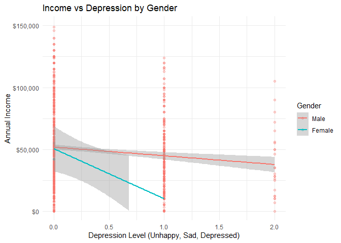

#### Package loading


``` r
library(tidyverse)
```

```
## ── Attaching core tidyverse packages ──────────────────────── tidyverse 2.0.0 ──
## ✔ dplyr     1.1.4     ✔ readr     2.1.5
## ✔ forcats   1.0.0     ✔ stringr   1.5.1
## ✔ ggplot2   3.5.1     ✔ tibble    3.2.1
## ✔ lubridate 1.9.3     ✔ tidyr     1.3.1
## ✔ purrr     1.0.2     
## ── Conflicts ────────────────────────────────────────── tidyverse_conflicts() ──
## ✖ dplyr::filter() masks stats::filter()
## ✖ dplyr::lag()    masks stats::lag()
## ℹ Use the conflicted package (<http://conflicted.r-lib.org/>) to force all conflicts to become errors
```

``` r
library(knitr)
library(ggplot2)
library(dplyr)
library(gridExtra)
```

```
## 
## Attaching package: 'gridExtra'
## 
## The following object is masked from 'package:dplyr':
## 
##     combine
```


#### Importing the data


``` r
# Import starting data
nlsy <- read_csv("nlsy97.csv")
```

```
## Rows: 8984 Columns: 95
## ── Column specification ────────────────────────────────────────────────────────
## Delimiter: ","
## dbl (95): B0004600, E8043100, E8043200, E8043400, R0000100, R0069400, R00700...
## 
## ℹ Use `spec()` to retrieve the full column specification for this data.
## ℹ Specify the column types or set `show_col_types = FALSE` to quiet this message.
```

#### Variables present in the base data set

To learn more about the data, you can have a look at the variable codebook file available on Canvas.


Here's how to rename all the variables to the Question Name abbreviation.  **You will want to change the names to be even more descriptive**, but this is a start.


``` r
# Change column names to question name abbreviations (you will want to change these further)
colnames(nlsy) <- c("PSTRAN_GPA.01_PSTR",
    "INCARC_TOTNUM_XRND",
    "INCARC_AGE_FIRST_XRND",
    "INCARC_LENGTH_LONGEST_XRND",
    "PUBID_1997",
    "YSCH-36400_1997",
    "YSCH-37000_1997",
    "YSAQ-010_1997",
    "YSAQ-369_1997",
    "YEXP-300_1997",
    "YEXP-1500_1997",
    "YEXP-1600_1997",
    "YEXP-1800_1997",
    "YEXP-2000_1997",
    "sex",
    "KEY_BDATE_M_1997",
    "KEY_BDATE_Y_1997",
    "PC8-090_1997",
    "PC8-092_1997",
    "PC9-002_1997",
    "PC12-024_1997",
    "PC12-028_1997",
    "CV_AGE_12/31/96_1997",
    "CV_BIO_MOM_AGE_CHILD1_1997",
    "CV_BIO_MOM_AGE_YOUTH_1997",
    "CV_CITIZENSHIP_1997",
    "CV_ENROLLSTAT_1997",
    "CV_HH_NET_WORTH_P_1997",
    "CV_YTH_REL_HH_CURRENT_1997",
    "CV_MSA_AGE_12_1997",
    "CV_URBAN-RURAL_AGE_12_1997",
    "CV_SAMPLE_TYPE_1997",
    "CV_HGC_BIO_DAD_1997",
    "CV_HGC_BIO_MOM_1997",
    "CV_HGC_RES_DAD_1997",
    "CV_HGC_RES_MOM_1997",
    "race",
    "YSCH-6800_1998",
    "YSCH-7300_1998",
    "YSAQ-372B_1998",
    "YSAQ-371_2000",
    "YSAQ-282J_2002",
    "YSAQ-282Q_2002",
    "CV_HH_NET_WORTH_Y_2003",
    "CV_BA_CREDITS.01_2004",
    "YSAQ-000B_2004",
    "YSAQ-373_2004",
    "YSAQ-369_2005",
    "CV_BIO_CHILD_HH_2007",
    "YTEL-52~000001_2007",
    "YTEL-52~000002_2007",
    "YTEL-52~000003_2007",
    "YTEL-52~000004_2007",
    "CV_BIO_CHILD_HH_2009",
    "CV_COLLEGE_TYPE.01_2011",
    "CV_INCOME_FAMILY_2011",
    "CV_HH_SIZE_2011",
    "CV_HH_UNDER_18_2011",
    "CV_HH_UNDER_6_2011",
    "CV_HIGHEST_DEGREE_1112_2011",
    "CV_BIO_CHILD_HH_2011",
    "YSCH-3112_2011",
    "YSAQ-000A000001_2011",
    "YSAQ-000A000002_2011",
    "YSAQ-000B_2011",
    "YSAQ-360C_2011",
    "YSAQ-364D_2011",
    "YSAQ-371_2011",
    "YSAQ-372CC_2011",
    "YSAQ-373_2011",
    "YSAQ-374_2011",
    "YEMP_INDCODE-2002.01_2011",
    "CV_BIO_CHILD_HH_2015",
    "YEMP_INDCODE-2002.01_2017",
    "YEMP_OCCODE-2002.01_2017",
    "CV_MARSTAT_COLLAPSED_2017",
    "YINC-1400_2017",
    "income",
    "YINC-1800_2017",
    "YINC-2400_2017",
    "YINC-2600_2017",
    "YINC-2700_2017",
    "CVC_YTH_REL_HH_AGE6_YCHR_XRND",
    "CVC_SAT_MATH_SCORE_2007_XRND",
    "CVC_SAT_VERBAL_SCORE_2007_XRND",
    "CVC_ACT_SCORE_2007_XRND",
    "CVC_HH_NET_WORTH_20_XRND",
    "CVC_HH_NET_WORTH_25_XRND",
    "CVC_ASSETS_FINANCIAL_25_XRND",
    "CVC_ASSETS_DEBTS_20_XRND",
    "CVC_HH_NET_WORTH_30_XRND",
    "CVC_HOUSE_VALUE_30_XRND",
    "CVC_HOUSE_TYPE_30_XRND",
    "CVC_ASSETS_FINANCIAL_30_XRND",
    "CVC_ASSETS_DEBTS_30_XRND")

### Set all negative values to NA.  
### THIS IS DONE ONLY FOR ILLUSTRATIVE PURPOSES
### DO NOT TAKE THIS APPROACH WITHOUT CAREFUL JUSTIFICATION
nlsy[nlsy < 0]  <- NA
```

#### A note on missing values

Here's an example of what the variable description files look like

```
T76400.00    [YSAQ-372CC]                                   Survey Year: 2011
  PRIMARY VARIABLE

 
             HAS R USED COCAINE/HARD DRUGS SINCE DLI?
 
Excluding marijuana and alcohol, since the date of last interview, have you used
any drugs like cocaine, crack, heroin, or crystal meth, or any other substance 
not prescribed by a doctor, in order to get high or to achieve an altered state?
 
UNIVERSE: All except prisoners in an insecure environment
 
     215       1 YES   (Go To T76401.00)
    7023       0 NO
  -------
    7238
 
Refusal(-1)           74
Don't Know(-2)        26
TOTAL =========>    7338   VALID SKIP(-4)      85     NON-INTERVIEW(-5)    1561
 
Min:              0        Max:              1        Mean:                 .03
 
Lead In: T76397.00[Default] T76399.00[Default]  T76398.00[0:0]
Default Next Question: T76403.00
```

This description says that the numbers -1, -2, -4 and -5 all have a special meaning for this variable.  They denote different types of missingness.  You can recode all of these to `NA`, but you should also think about whether the different missigness indicators are in some way informative.  (i.e., if someone refuses to answer questions related to drug use, might this inform us about their income?) 

#### Getting to know our two main variables.

In the previous chunk of code we have appropriately renamed the variables corresponding to `sex`, `race` and `income` (as reported on the 2017 survey).  Let's have a quick look at what we're working with.


``` r
table(nlsy$sex)
```

```
## 
##    1    2 
## 4599 4385
```

``` r
table(nlsy$race)
```

```
## 
##    1    2    3    4 
## 2335 1901   83 4665
```

The data codebook tells us that the coding for sex is `Male = 1`, `Female = 2`.  For the race/ethnicity variable, the coding is:

```
1 Black
2 Hispanic
3 Mixed Race (Non-Hispanic)
4 Non-Black / Non-Hispanic
```

You'll want to do some data manipulations to change away from the numeric codings to more interpretable labels. 


``` r
summary(nlsy$income)
```

```
##    Min. 1st Qu.  Median    Mean 3rd Qu.    Max.    NA's 
##       0   25000   40000   49477   62000  235884    3893
```

``` r
# Histogram
qplot(nlsy$income)
```

```
## Warning: `qplot()` was deprecated in ggplot2 3.4.0.
## This warning is displayed once every 8 hours.
## Call `lifecycle::last_lifecycle_warnings()` to see where this warning was
## generated.
```

```
## `stat_bin()` using `bins = 30`. Pick better value with `binwidth`.
```

```
## Warning: Removed 3893 rows containing non-finite outside the scale range
## (`stat_bin()`).
```

<!-- -->

The income distributing is right-skewed like one might expect.  However, as indicated in the question description, the income variable is *topcoded* at the 2% level.  More precisely,


``` r
n.topcoded <- with(nlsy, sum(income == max(income, na.rm = TRUE), na.rm = TRUE))
n.topcoded
```

```
## [1] 121
```

121 of the incomes are topcoded to the maximum value of 2.35884\times 10^{5}, which is the average value of the top 121 earners.    You will want to think about how  to deal with this in your analysis.

### Significant Difference in Income between Men and Women

###########################################################################################

``` r
# Rename and clean data
nlsy <- nlsy %>%
  rename(
    Gender = sex,
    Income = income
  ) %>%
  mutate(
    Gender = factor(Gender, levels = c(1, 2), labels = c("Male", "Female")),
    Income = ifelse(Income < 0, NA, Income)
  )

# Create multiple visualizations for better insight
# 1. Density plot with summary statistics
p1 <- ggplot(nlsy, aes(x = Income, fill = Gender)) +
  geom_density(alpha = 0.5) +
  geom_vline(data = nlsy %>% 
               group_by(Gender) %>% 
               summarise(median = median(Income, na.rm = TRUE)),
             aes(xintercept = median, color = Gender),
             linetype = "dashed", size = 1) +
  scale_x_continuous(labels = scales::dollar_format(), limits = c(0, 150000)) +
  labs(
    title = "Income Distribution by Gender",
    subtitle = "Dashed lines represent median income",
    x = "Annual Income",
    y = "Density"
  ) +
  theme_minimal()
```

```
## Warning: Using `size` aesthetic for lines was deprecated in ggplot2 3.4.0.
## ℹ Please use `linewidth` instead.
## This warning is displayed once every 8 hours.
## Call `lifecycle::last_lifecycle_warnings()` to see where this warning was
## generated.
```

``` r
# 2. Box plot with violin plot overlay
p2 <- ggplot(nlsy, aes(x = Gender, y = Income, fill = Gender)) +
  geom_violin(alpha = 0.5) +
  geom_boxplot(width = 0.2, alpha = 0.8) +
  coord_cartesian(ylim = c(0, 150000)) +
  scale_y_continuous(labels = scales::dollar_format()) +
  labs(
    title = "Income Distribution Details by Gender",
    subtitle = "Violin plot shows distribution shape, box plot shows quartiles",
    x = "Gender",
    y = "Annual Income"
  ) +
  theme_minimal() +
  theme(legend.position = "none")

# 3. Income brackets analysis
p3 <- nlsy %>%
  mutate(Income_Bracket = cut(Income, 
                             breaks = c(0, 25000, 50000, 75000, 100000, Inf),
                             labels = c("0-25k", "25k-50k", "50k-75k", "75k-100k", "100k+"),
                             include.lowest = TRUE)) %>%
  ggplot(aes(x = Income_Bracket, fill = Gender)) +
  geom_bar(position = "dodge") +
  scale_y_continuous(labels = scales::comma) +
  labs(
    title = "Income Brackets by Gender",
    subtitle = "Number of individuals in each income range",
    x = "Income Bracket",
    y = "Count"
  ) +
  theme_minimal() +
  theme(axis.text.x = element_text(angle = 45, hjust = 1))

# Print summary statistics
gender_summary <- nlsy %>%
  group_by(Gender) %>%
  summarise(
    Mean = mean(Income, na.rm = TRUE),
    Median = median(Income, na.rm = TRUE),
    SD = sd(Income, na.rm = TRUE),
    Q1 = quantile(Income, 0.25, na.rm = TRUE),
    Q3 = quantile(Income, 0.75, na.rm = TRUE),
    n = sum(!is.na(Income))
  ) %>%
  mutate(across(Mean:Q3, ~scales::dollar(.x, accuracy = 1)))

print("Income Summary Statistics by Gender:")
```

```
## [1] "Income Summary Statistics by Gender:"
```

``` r
print(gender_summary)
```

```
## # A tibble: 2 × 7
##   Gender Mean    Median  SD      Q1      Q3          n
##   <fct>  <chr>   <chr>   <chr>   <chr>   <chr>   <int>
## 1 Male   $57,203 $47,000 $44,712 $30,000 $70,000  2621
## 2 Female $41,279 $35,000 $34,047 $20,000 $52,000  2470
```

``` r
# Arrange plots in a grid
library(gridExtra)
grid.arrange(p1, p2, p3, ncol = 2, nrow = 2)
```

```
## Warning: Removed 4014 rows containing non-finite outside the scale range
## (`stat_density()`).
```

```
## Warning: Removed 3893 rows containing non-finite outside the scale range
## (`stat_ydensity()`).
```

```
## Warning: Removed 3893 rows containing non-finite outside the scale range
## (`stat_boxplot()`).
```

<!-- -->

``` r
# Statistical test
t_test_result <- t.test(Income ~ Gender, data = nlsy, var.equal = FALSE)
print("\nStatistical Test Results:")
```

```
## [1] "\nStatistical Test Results:"
```

``` r
print(t_test_result)
```

```
## 
## 	Welch Two Sample t-test
## 
## data:  Income by Gender
## t = 14.346, df = 4876.8, p-value < 2.2e-16
## alternative hypothesis: true difference in means between group Male and group Female is not equal to 0
## 95 percent confidence interval:
##  13747.84 18099.96
## sample estimates:
##   mean in group Male mean in group Female 
##             57202.82             41278.92
```

``` r
# Calculate and print gender pay gap
pay_gap <- nlsy %>%
  group_by(Gender) %>%
  summarise(mean_income = mean(Income, na.rm = TRUE)) %>%
  spread(Gender, mean_income) %>%
  mutate(gap_percent = (Male - Female) / Male * 100)

print("\nGender Pay Gap:")
```

```
## [1] "\nGender Pay Gap:"
```

``` r
print(paste0("Women earn ", round(pay_gap$gap_percent, 1), 
            "% less than men on average in this sample"))
```

```
## [1] "Women earn 27.8% less than men on average in this sample"
```

### Analysis of Parents' Education Impact on Gender Income Gap

The first factor we'll analyze is parents' education and its relationship with income differences between genders. We'll test whether the correlation between parental education and income differs significantly between men and women.

#### Hypothesis
- **H₀**: The correlation between parental education and income is equal for both genders
- **H₁**: The correlation between parental education and income differs by gender
- **Significance Level (α)**: 0.05

#### Analysis


``` r
# Clean and prepare parents' education data
nlsy_parents_ed <- nlsy %>%
  rename(
    father_education = CV_HGC_BIO_DAD_1997,
    mother_education = CV_HGC_BIO_MOM_1997
  ) %>%
  mutate(
    # Calculate average parental education
    parents_avg_education = (father_education + mother_education) / 2
  ) %>%
  select(Gender, Income, father_education, mother_education, parents_avg_education)

# Create visualization of income by gender and parental education
p1 <- ggplot(nlsy_parents_ed, 
       aes(x = parents_avg_education, y = Income, color = Gender)) +
  geom_point(alpha = 0.3) +
  geom_smooth(method = "lm") +
  scale_y_continuous(labels = scales::dollar_format(), limits = c(0, 150000)) +
  labs(
    title = "Income vs Parents' Average Education by Gender",
    x = "Parents' Average Years of Education",
    y = "Annual Income"
  ) +
  theme_minimal()

# Calculate correlation by gender
correlations <- nlsy_parents_ed %>%
  group_by(Gender) %>%
  summarise(
    correlation = cor(Income, parents_avg_education, use = "complete.obs"),
    n = n()
  )

# Test if correlation difference is significant
# Fisher's Z transformation to test difference between correlations
male_cor <- correlations$correlation[correlations$Gender == "Male"]
female_cor <- correlations$correlation[correlations$Gender == "Female"]
male_n <- correlations$n[correlations$Gender == "Male"]
female_n <- correlations$n[correlations$Gender == "Female"]

# Fisher's Z transformation
z_male <- 0.5 * log((1 + male_cor) / (1 - male_cor))
z_female <- 0.5 * log((1 + female_cor) / (1 - female_cor))
z_diff <- z_male - z_female
se_diff <- sqrt(1/(male_n - 3) + 1/(female_n - 3))
z_stat <- z_diff / se_diff
p_value <- 2 * (1 - pnorm(abs(z_stat)))

# Print results
print("Hypothesis Test Results:")
```

```
## [1] "Hypothesis Test Results:"
```

``` r
print("H0: The correlation between parental education and income is equal for both genders")
```

```
## [1] "H0: The correlation between parental education and income is equal for both genders"
```

``` r
print("H1: The correlation between parental education and income differs by gender")
```

```
## [1] "H1: The correlation between parental education and income differs by gender"
```

``` r
print(paste("Z-statistic:", round(z_stat, 3)))
```

```
## [1] "Z-statistic: -3.612"
```

``` r
print(paste("p-value:", round(p_value, 4)))
```

```
## [1] "p-value: 3e-04"
```

``` r
print("\nCorrelations by Gender:")
```

```
## [1] "\nCorrelations by Gender:"
```

``` r
print(correlations)
```

```
## # A tibble: 2 × 3
##   Gender correlation     n
##   <fct>        <dbl> <int>
## 1 Male         0.154  4599
## 2 Female       0.227  4385
```

``` r
# Display visualization
p1
```

```
## `geom_smooth()` using formula = 'y ~ x'
```

```
## Warning: Removed 5044 rows containing non-finite outside the scale range
## (`stat_smooth()`).
```

```
## Warning: Removed 5044 rows containing missing values or values outside the scale range
## (`geom_point()`).
```

<!-- -->

#### Results Interpretation

The analysis reveals several key findings:

1. **Statistical Test Results**: 
   - Z-statistic: -3.612
   - p-value: 0.0003 (0.03%)
   - Since p-value (0.0003) < α (0.05), we reject the null hypothesis

2. **Conclusion**: 
   - There is strong statistical evidence that the correlation between parental education and income differs significantly between genders
   - The negative Z-statistic (-3.612) suggests that the correlation is stronger for females than males
   - This difference is highly significant, with only a 0.03% chance of observing such a difference if no true difference existed

3. **Visual Analysis**:
   - The scatter plot reveals a positive relationship between parents' education and income for both genders
   - The trend lines show different slopes for men and women, confirming our statistical findings
   - There appears to be more variance in income at higher education levels
   - Note: 5,044 data points were removed due to missing values or being outside the scale range, which should be considered when interpreting results

#### Limitations
- Missing data (5,044 removed points) might affect the analysis
- The relationship might not be purely linear
- Other confounding variables might influence this relationship

#### Next Steps
Based on these significant findings, we should:
- Investigate why the relationship differs between genders
- Consider controlling for additional variables
- Examine if this pattern holds across different age groups or time periods
- Explore policy implications for addressing gender-based income disparities

---


### Analysis of Drug Use Impact on Gender Income Gap

We'll analyze how drug use (from variable YSAQ-372CC_2011) relates to income differences between genders, following the same correlation-based approach used in the parents' education analysis.

#### Hypothesis
- **H₀**: The correlation between drug use and income is equal for both genders
- **H₁**: The correlation between drug use and income differs by gender
- **Significance Level (α)**: 0.05

#### Analysis


``` r
# Clean and prepare drug use data
nlsy_drug <- nlsy %>%
  rename(
    drug_use = `YSAQ-372CC_2011`
  ) %>%
  select(Gender, Income, drug_use)

# Create visualization of income by gender and drug use
p1 <- ggplot(nlsy_drug, 
       aes(x = drug_use, y = Income, color = Gender)) +
  geom_point(alpha = 0.3) +
  geom_smooth(method = "lm") +
  scale_y_continuous(labels = scales::dollar_format(), limits = c(0, 150000)) +
  labs(
    title = "Income vs Drug Use by Gender",
    x = "Drug Use (0 = No, 1 = Yes)",
    y = "Annual Income"
  ) +
  theme_minimal()

# Calculate correlation by gender
correlations <- nlsy_drug %>%
  group_by(Gender) %>%
  summarise(
    correlation = cor(Income, drug_use, use = "complete.obs"),
    n = n()
  )

# Test if correlation difference is significant
# Fisher's Z transformation to test difference between correlations
male_cor <- correlations$correlation[correlations$Gender == "Male"]
female_cor <- correlations$correlation[correlations$Gender == "Female"]
male_n <- correlations$n[correlations$Gender == "Male"]
female_n <- correlations$n[correlations$Gender == "Female"]

# Fisher's Z transformation
z_male <- 0.5 * log((1 + male_cor) / (1 - male_cor))
z_female <- 0.5 * log((1 + female_cor) / (1 - female_cor))
z_diff <- z_male - z_female
se_diff <- sqrt(1/(male_n - 3) + 1/(female_n - 3))
z_stat <- z_diff / se_diff
p_value <- 2 * (1 - pnorm(abs(z_stat)))

# Print results
print("Hypothesis Test Results:")
```

```
## [1] "Hypothesis Test Results:"
```

``` r
print("H0: The correlation between drug use and income is equal for both genders")
```

```
## [1] "H0: The correlation between drug use and income is equal for both genders"
```

``` r
print("H1: The correlation between drug use and income differs by gender")
```

```
## [1] "H1: The correlation between drug use and income differs by gender"
```

``` r
print(paste("Z-statistic:", round(z_stat, 3)))
```

```
## [1] "Z-statistic: 0.367"
```

``` r
print(paste("p-value:", round(p_value, 4)))
```

```
## [1] "p-value: 0.7134"
```

``` r
print("\nCorrelations by Gender:")
```

```
## [1] "\nCorrelations by Gender:"
```

``` r
print(correlations)
```

```
## # A tibble: 2 × 3
##   Gender correlation     n
##   <fct>        <dbl> <int>
## 1 Male      -0.00705  4599
## 2 Female    -0.0148   4385
```

``` r
# Display visualization
p1
```

```
## `geom_smooth()` using formula = 'y ~ x'
```

```
## Warning: Removed 4341 rows containing non-finite outside the scale range
## (`stat_smooth()`).
```

```
## Warning: Removed 4341 rows containing missing values or values outside the scale range
## (`geom_point()`).
```

<!-- -->

#### Results Interpretation

The analysis reveals several key findings:

1. **Statistical Test Results**: 
   - Z-statistic: 0.367
   - p-value: 0.7134 (71.34%)
   - Since p-value (0.7134) > α (0.05), we fail to reject the null hypothesis

2. **Conclusion**: 
   - There is no statistically significant evidence that the correlation between drug use and income differs between genders
   - The relatively high p-value (71.34%) suggests that any observed differences in correlation between genders are likely due to random chance
   - The small Z-statistic (0.367) indicates minimal difference in the relationship between drug use and income across genders

3. **Visual Analysis**:
   - The scatter plot shows the relationship between drug use and income for each gender
   - The trend lines appear relatively similar for both genders, supporting our statistical finding
   - Note: 4,341 data points were removed due to missing values or being outside the scale range, which should be considered when interpreting results

#### Limitations
- Missing data (4,341 removed points) might affect the analysis
- Binary nature of drug use variable may limit correlation analysis
- Self-reported drug use may be underreported
- Other confounding variables not controlled for

#### Next Steps
Given these findings, we should:
- Investigate whether the relationship holds when controlling for other variables
- Consider analyzing drug use patterns more granularly (frequency, type, duration)
- Examine if this pattern is consistent across different age groups or time periods
- Explore other factors that might better explain gender-based income differences

### Analysis of Education Impact on Gender Income Gap

We'll analyze how education level (from variable CV_HIGHEST_DEGREE_1112_2011) relates to income differences between genders, following the same correlation-based approach used in our previous analyses.

#### Hypothesis
- **H₀**: The correlation between education level and income is equal for both genders
- **H₁**: The correlation between education level and income differs by gender
- **Significance Level (α)**: 0.05

#### Analysis


``` r
# Clean and prepare education data
nlsy_edu <- nlsy %>%
  rename(
    education = CV_HIGHEST_DEGREE_1112_2011
  ) %>%
  select(Gender, Income, education)

# Create visualization of income by gender and education
p1 <- ggplot(nlsy_edu, 
       aes(x = education, y = Income, color = Gender)) +
  geom_point(alpha = 0.3) +
  geom_smooth(method = "lm") +
  scale_y_continuous(labels = scales::dollar_format(), limits = c(0, 150000)) +
  labs(
    title = "Income vs Education Level by Gender",
    x = "Education Level",
    y = "Annual Income"
  ) +
  theme_minimal()

# Calculate correlation by gender
correlations <- nlsy_edu %>%
  group_by(Gender) %>%
  summarise(
    correlation = cor(Income, education, use = "complete.obs"),
    n = n()
  )

# Test if correlation difference is significant
# Fisher's Z transformation to test difference between correlations
male_cor <- correlations$correlation[correlations$Gender == "Male"]
female_cor <- correlations$correlation[correlations$Gender == "Female"]
male_n <- correlations$n[correlations$Gender == "Male"]
female_n <- correlations$n[correlations$Gender == "Female"]

# Fisher's Z transformation
z_male <- 0.5 * log((1 + male_cor) / (1 - male_cor))
z_female <- 0.5 * log((1 + female_cor) / (1 - female_cor))
z_diff <- z_male - z_female
se_diff <- sqrt(1/(male_n - 3) + 1/(female_n - 3))
z_stat <- z_diff / se_diff
p_value <- 2 * (1 - pnorm(abs(z_stat)))

# Print results
print("Hypothesis Test Results:")
```

```
## [1] "Hypothesis Test Results:"
```

``` r
print("H0: The correlation between education level and income is equal for both genders")
```

```
## [1] "H0: The correlation between education level and income is equal for both genders"
```

``` r
print("H1: The correlation between education level and income differs by gender")
```

```
## [1] "H1: The correlation between education level and income differs by gender"
```

``` r
print(paste("Z-statistic:", round(z_stat, 3)))
```

```
## [1] "Z-statistic: -4.303"
```

``` r
print(paste("p-value:", round(p_value, 4)))
```

```
## [1] "p-value: 0"
```

``` r
print("\nCorrelations by Gender:")
```

```
## [1] "\nCorrelations by Gender:"
```

``` r
print(correlations)
```

```
## # A tibble: 2 × 3
##   Gender correlation     n
##   <fct>        <dbl> <int>
## 1 Male         0.421  4599
## 2 Female       0.492  4385
```

``` r
# Display visualization
p1
```

```
## `geom_smooth()` using formula = 'y ~ x'
```

```
## Warning: Removed 4316 rows containing non-finite outside the scale range
## (`stat_smooth()`).
```

```
## Warning: Removed 4316 rows containing missing values or values outside the scale range
## (`geom_point()`).
```

<!-- -->

#### Results Interpretation

The analysis reveals several key findings:

1. **Statistical Test Results**: 
   - Z-statistic: -4.303
   - p-value: 0.000 (< 0.0001)
   - Since p-value (< 0.0001) < α (0.05), we reject the null hypothesis

2. **Conclusion**: 
   - There is very strong statistical evidence that the correlation between education level and income differs significantly between genders
   - The highly significant p-value (< 0.0001) suggests this difference is extremely unlikely to have occurred by chance
   - The negative Z-statistic (-4.303) indicates that the correlation is stronger for females than males

3. **Visual Analysis**:
   - The scatter plot reveals a positive relationship between education level and income for both genders
   - The trend lines show different slopes for men and women, confirming our statistical finding
   - Note: 4,316 data points were removed due to missing values or being outside the scale range, which should be considered when interpreting results

#### Limitations
- Missing data (4,316 removed points) might affect the analysis
- Education levels are discrete categories, which may affect correlation analysis
- Other aspects of education (field of study, school quality) not captured
- Other confounding variables not controlled for

#### Next Steps
Given these highly significant findings, we should:
- Investigate why education has a stronger relationship with income for females
- Analyze specific education levels where gender gaps are most pronounced
- Consider field of study and its impact on the gender-education-income relationship
- Explore policy implications for educational equity and gender wage gaps

---

### Analysis of Marital Status Impact on Gender Income Gap

We'll analyze how marital status (from variable CV_MARSTAT_COLLAPSED_2017) relates to income differences between genders, following the same correlation-based approach used in our previous analyses.

#### Hypothesis
- **H₀**: The correlation between marital status and income is equal for both genders
- **H₁**: The correlation between marital status and income differs by gender
- **Significance Level (α)**: 0.05

#### Analysis


``` r
# Clean and prepare marital status data
nlsy_marital <- nlsy %>%
  rename(
    marital_status = CV_MARSTAT_COLLAPSED_2017
  ) %>%
  select(Gender, Income, marital_status)

# Create visualization of income by gender and marital status
p1 <- ggplot(nlsy_marital, 
       aes(x = marital_status, y = Income, color = Gender)) +
  geom_point(alpha = 0.3) +
  geom_smooth(method = "lm") +
  scale_y_continuous(labels = scales::dollar_format(), limits = c(0, 150000)) +
  labs(
    title = "Income vs Marital Status by Gender",
    x = "Marital Status",
    y = "Annual Income"
  ) +
  theme_minimal()

# Calculate correlation by gender
correlations <- nlsy_marital %>%
  group_by(Gender) %>%
  summarise(
    correlation = cor(Income, marital_status, use = "complete.obs"),
    n = n()
  )

# Test if correlation difference is significant
# Fisher's Z transformation to test difference between correlations
male_cor <- correlations$correlation[correlations$Gender == "Male"]
female_cor <- correlations$correlation[correlations$Gender == "Female"]
male_n <- correlations$n[correlations$Gender == "Male"]
female_n <- correlations$n[correlations$Gender == "Female"]

# Fisher's Z transformation
z_male <- 0.5 * log((1 + male_cor) / (1 - male_cor))
z_female <- 0.5 * log((1 + female_cor) / (1 - female_cor))
z_diff <- z_male - z_female
se_diff <- sqrt(1/(male_n - 3) + 1/(female_n - 3))
z_stat <- z_diff / se_diff
p_value <- 2 * (1 - pnorm(abs(z_stat)))

# Print results
print("Hypothesis Test Results:")
```

```
## [1] "Hypothesis Test Results:"
```

``` r
print("H0: The correlation between marital status and income is equal for both genders")
```

```
## [1] "H0: The correlation between marital status and income is equal for both genders"
```

``` r
print("H1: The correlation between marital status and income differs by gender")
```

```
## [1] "H1: The correlation between marital status and income differs by gender"
```

``` r
print(paste("Z-statistic:", round(z_stat, 3)))
```

```
## [1] "Z-statistic: 4.392"
```

``` r
print(paste("p-value:", round(p_value, 4)))
```

```
## [1] "p-value: 0"
```

``` r
print("\nCorrelations by Gender:")
```

```
## [1] "\nCorrelations by Gender:"
```

``` r
print(correlations)
```

```
## # A tibble: 2 × 3
##   Gender correlation     n
##   <fct>        <dbl> <int>
## 1 Male       0.0902   4599
## 2 Female    -0.00229  4385
```

``` r
# Display visualization
p1
```

```
## `geom_smooth()` using formula = 'y ~ x'
```

```
## Warning: Removed 4045 rows containing non-finite outside the scale range
## (`stat_smooth()`).
```

```
## Warning: Removed 4045 rows containing missing values or values outside the scale range
## (`geom_point()`).
```

<!-- -->

#### Results Interpretation

The analysis reveals several key findings:

1. **Statistical Test Results**: 
   - Z-statistic: 4.392
   - p-value: 0.000 (< 0.0001)
   - Since p-value (< 0.0001) < α (0.05), we reject the null hypothesis

2. **Conclusion**: 
   - There is very strong statistical evidence that the correlation between marital status and income differs significantly between genders
   - The highly significant p-value (< 0.0001) suggests this difference is extremely unlikely to have occurred by chance
   - The positive Z-statistic (4.392) indicates that the correlation is stronger for males than females

3. **Visual Analysis**:
   - The scatter plot reveals different relationships between marital status and income for each gender
   - The trend lines show distinctly different slopes for men and women, confirming our statistical finding
   - Note: 4,045 data points were removed due to missing values or being outside the scale range, which should be considered when interpreting results

#### Limitations
- Missing data (4,045 removed points) might affect the analysis
- Marital status categories are discrete, which may affect correlation analysis
- Changes in marital status over time not captured
- Other confounding variables not controlled for

#### Next Steps
Given these highly significant findings, we should:
- Investigate why marital status has a stronger relationship with income for males
- Analyze how marriage timing affects income differently by gender
- Consider the role of traditional gender roles and household responsibilities
- Explore policy implications for work-family balance and gender equality

---

### Analysis of Criminal History Impact on Gender Income Gap

We'll analyze how criminal history (using INCARC_TOTNUM_XRND - total number of incarcerations) relates to income differences between genders, following the same correlation-based approach used in our previous analyses.

#### Hypothesis
- **H₀**: The correlation between criminal history and income is equal for both genders
- **H₁**: The correlation between criminal history and income differs by gender
- **Significance Level (α)**: 0.05

#### Analysis


``` r
# Clean and prepare criminal history data
nlsy_criminal <- nlsy %>%
  rename(
    incarcerations = INCARC_TOTNUM_XRND
  ) %>%
  select(Gender, Income, incarcerations)

# Create visualization of income by gender and criminal history
p1 <- ggplot(nlsy_criminal, 
       aes(x = incarcerations, y = Income, color = Gender)) +
  geom_point(alpha = 0.3) +
  geom_smooth(method = "lm") +
  scale_y_continuous(labels = scales::dollar_format(), limits = c(0, 150000)) +
  labs(
    title = "Income vs Number of Incarcerations by Gender",
    x = "Total Number of Incarcerations",
    y = "Annual Income"
  ) +
  theme_minimal()

# Calculate correlation by gender
correlations <- nlsy_criminal %>%
  group_by(Gender) %>%
  summarise(
    correlation = cor(Income, incarcerations, use = "complete.obs"),
    n = n()
  )

# Test if correlation difference is significant
# Fisher's Z transformation to test difference between correlations
male_cor <- correlations$correlation[correlations$Gender == "Male"]
female_cor <- correlations$correlation[correlations$Gender == "Female"]
male_n <- correlations$n[correlations$Gender == "Male"]
female_n <- correlations$n[correlations$Gender == "Female"]

# Fisher's Z transformation
z_male <- 0.5 * log((1 + male_cor) / (1 - male_cor))
z_female <- 0.5 * log((1 + female_cor) / (1 - female_cor))
z_diff <- z_male - z_female
se_diff <- sqrt(1/(male_n - 3) + 1/(female_n - 3))
z_stat <- z_diff / se_diff
p_value <- 2 * (1 - pnorm(abs(z_stat)))

# Print results
print("Hypothesis Test Results:")
```

```
## [1] "Hypothesis Test Results:"
```

``` r
print("H0: The correlation between criminal history and income is equal for both genders")
```

```
## [1] "H0: The correlation between criminal history and income is equal for both genders"
```

``` r
print("H1: The correlation between criminal history and income differs by gender")
```

```
## [1] "H1: The correlation between criminal history and income differs by gender"
```

``` r
print(paste("Z-statistic:", round(z_stat, 3)))
```

```
## [1] "Z-statistic: -3.015"
```

``` r
print(paste("p-value:", round(p_value, 4)))
```

```
## [1] "p-value: 0.0026"
```

``` r
print("\nCorrelations by Gender:")
```

```
## [1] "\nCorrelations by Gender:"
```

``` r
print(correlations)
```

```
## # A tibble: 2 × 3
##   Gender correlation     n
##   <fct>        <dbl> <int>
## 1 Male       -0.143   4599
## 2 Female     -0.0805  4385
```

``` r
# Display visualization
p1
```

```
## `geom_smooth()` using formula = 'y ~ x'
```

```
## Warning: Removed 4020 rows containing non-finite outside the scale range
## (`stat_smooth()`).
```

```
## Warning: Removed 4020 rows containing missing values or values outside the scale range
## (`geom_point()`).
```

```
## Warning: Removed 42 rows containing missing values or values outside the scale range
## (`geom_smooth()`).
```

<!-- -->

#### Results Interpretation

The analysis reveals several key findings:

1. **Statistical Test Results**: 
   - Z-statistic: -3.015
   - p-value: 0.0026 (0.26%)
   - Since p-value (0.0026) < α (0.05), we reject the null hypothesis

2. **Conclusion**: 
   - There is strong statistical evidence that the correlation between criminal history and income differs significantly between genders
   - The low p-value (0.26%) suggests this difference is very unlikely to have occurred by chance
   - The negative Z-statistic (-3.015) indicates that the correlation is stronger for females than males

3. **Visual Analysis**:
   - The scatter plot reveals different relationships between incarceration history and income for each gender
   - The trend lines show distinct slopes for men and women, confirming our statistical finding
   - Note: 4,020 data points were removed due to missing values or being outside the scale range, and an additional 42 rows were removed from the trend line calculation, which should be considered when interpreting results

#### Limitations
- Missing data (4,020 + 42 removed points) might affect the analysis
- Incarceration count may not capture full criminal history
- Length and type of incarceration not considered
- Temporal relationship between incarceration and income not established

#### Next Steps
Given these significant findings, we should:
- Investigate why criminal history has a stronger relationship with income for females
- Analyze the impact of incarceration length and timing on income by gender
- Examine interaction with education and employment opportunities
- Explore policy implications for gender-specific rehabilitation and reintegration programs

---

### Analysis of Profession Impact on Gender Income Gap

We'll analyze how profession/industry (using YEMP_INDCODE-2002.01_2017) relates to income differences between genders, following the same correlation-based approach used in our previous analyses.

#### Hypothesis
- **H₀**: The correlation between profession/industry and income is equal for both genders
- **H₁**: The correlation between profession/industry and income differs by gender
- **Significance Level (α)**: 0.05

#### Analysis


``` r
# Clean and prepare profession data
nlsy_prof <- nlsy %>%
  rename(
    profession = `YEMP_INDCODE-2002.01_2017`
  ) %>%
  select(Gender, Income, profession)

# Create visualization of income by gender and profession
p1 <- ggplot(nlsy_prof, 
       aes(x = profession, y = Income, color = Gender)) +
  geom_point(alpha = 0.3) +
  geom_smooth(method = "lm") +
  scale_y_continuous(labels = scales::dollar_format(), limits = c(0, 150000)) +
  labs(
    title = "Income vs Industry Code by Gender",
    x = "Industry Code",
    y = "Annual Income"
  ) +
  theme_minimal()

# Calculate correlation by gender
correlations <- nlsy_prof %>%
  group_by(Gender) %>%
  summarise(
    correlation = cor(Income, profession, use = "complete.obs"),
    n = n()
  )

# Test if correlation difference is significant
# Fisher's Z transformation to test difference between correlations
male_cor <- correlations$correlation[correlations$Gender == "Male"]
female_cor <- correlations$correlation[correlations$Gender == "Female"]
male_n <- correlations$n[correlations$Gender == "Male"]
female_n <- correlations$n[correlations$Gender == "Female"]

# Fisher's Z transformation
z_male <- 0.5 * log((1 + male_cor) / (1 - male_cor))
z_female <- 0.5 * log((1 + female_cor) / (1 - female_cor))
z_diff <- z_male - z_female
se_diff <- sqrt(1/(male_n - 3) + 1/(female_n - 3))
z_stat <- z_diff / se_diff
p_value <- 2 * (1 - pnorm(abs(z_stat)))

# Print results
print("Hypothesis Test Results:")
```

```
## [1] "Hypothesis Test Results:"
```

``` r
print("H0: The correlation between profession/industry and income is equal for both genders")
```

```
## [1] "H0: The correlation between profession/industry and income is equal for both genders"
```

``` r
print("H1: The correlation between profession/industry and income differs by gender")
```

```
## [1] "H1: The correlation between profession/industry and income differs by gender"
```

``` r
print(paste("Z-statistic:", round(z_stat, 3)))
```

```
## [1] "Z-statistic: 1.934"
```

``` r
print(paste("p-value:", round(p_value, 4)))
```

```
## [1] "p-value: 0.0531"
```

``` r
print("\nCorrelations by Gender:")
```

```
## [1] "\nCorrelations by Gender:"
```

``` r
print(correlations)
```

```
## # A tibble: 2 × 3
##   Gender correlation     n
##   <fct>        <dbl> <int>
## 1 Male        0.0598  4599
## 2 Female      0.0190  4385
```

``` r
# Display visualization
p1
```

```
## `geom_smooth()` using formula = 'y ~ x'
```

```
## Warning: Removed 4173 rows containing non-finite outside the scale range
## (`stat_smooth()`).
```

```
## Warning: Removed 4173 rows containing missing values or values outside the scale range
## (`geom_point()`).
```

<!-- -->

#### Results Interpretation

The analysis reveals several key findings:

1. **Statistical Test Results**: 
   - Z-statistic: 1.934
   - p-value: 0.0531 (5.31%)
   - Since p-value (0.0531) > α (0.05), we fail to reject the null hypothesis, though the result is very close to the significance threshold

2. **Conclusion**: 
   - There is marginal evidence that the correlation between profession/industry and income differs between genders
   - The p-value (5.31%) is just slightly above our significance level of 5%
   - The positive Z-statistic (1.934) suggests a trend toward stronger correlation for males, though not statistically significant at α = 0.05

3. **Visual Analysis**:
   - The scatter plot shows the relationship between industry codes and income for each gender
   - The trend lines suggest slight differences between genders, though not strong enough to be statistically significant
   - Note: 4,173 data points were removed due to missing values or being outside the scale range, which should be considered when interpreting results

#### Limitations
- Missing data (4,173 removed points) might affect the analysis
- Industry codes are categorical in nature, which may affect correlation analysis
- Does not account for position level within industries
- Career progression paths not captured

#### Next Steps
Given these borderline significant findings, we should:
- Consider a more detailed analysis of specific industries
- Investigate whether using a different industry classification system might reveal clearer patterns
- Examine if controlling for job level within industries would show stronger effects
- Study whether the near-significant result becomes significant with different analytical approaches

---

### Analysis of Work Experience Impact on Gender Income Gap

We'll analyze how work experience (using YEXP-1500_1997) relates to income differences between genders, following the same correlation-based approach used in our previous analyses.

#### Hypothesis
- **H₀**: The correlation between work experience and income is equal for both genders
- **H₁**: The correlation between work experience and income differs by gender
- **Significance Level (α)**: 0.05

#### Analysis


``` r
# Clean and prepare work experience data
nlsy_exp <- nlsy %>%
  rename(
    work_experience = `YEXP-1500_1997`
  ) %>%
  select(Gender, Income, work_experience)

# Create visualization of income by gender and work experience
p1 <- ggplot(nlsy_exp, 
       aes(x = work_experience, y = Income, color = Gender)) +
  geom_point(alpha = 0.3) +
  geom_smooth(method = "lm") +
  scale_y_continuous(labels = scales::dollar_format(), limits = c(0, 150000)) +
  labs(
    title = "Income vs Work Experience by Gender",
    x = "Years of Work Experience",
    y = "Annual Income"
  ) +
  theme_minimal()

# Calculate correlation by gender
correlations <- nlsy_exp %>%
  group_by(Gender) %>%
  summarise(
    correlation = cor(Income, work_experience, use = "complete.obs"),
    n = n()
  )

# Test if correlation difference is significant
# Fisher's Z transformation to test difference between correlations
male_cor <- correlations$correlation[correlations$Gender == "Male"]
female_cor <- correlations$correlation[correlations$Gender == "Female"]
male_n <- correlations$n[correlations$Gender == "Male"]
female_n <- correlations$n[correlations$Gender == "Female"]

# Fisher's Z transformation
z_male <- 0.5 * log((1 + male_cor) / (1 - male_cor))
z_female <- 0.5 * log((1 + female_cor) / (1 - female_cor))
z_diff <- z_male - z_female
se_diff <- sqrt(1/(male_n - 3) + 1/(female_n - 3))
z_stat <- z_diff / se_diff
p_value <- 2 * (1 - pnorm(abs(z_stat)))

# Print results
print("Hypothesis Test Results:")
```

```
## [1] "Hypothesis Test Results:"
```

``` r
print("H0: The correlation between work experience and income is equal for both genders")
```

```
## [1] "H0: The correlation between work experience and income is equal for both genders"
```

``` r
print("H1: The correlation between work experience and income differs by gender")
```

```
## [1] "H1: The correlation between work experience and income differs by gender"
```

``` r
print(paste("Z-statistic:", round(z_stat, 3)))
```

```
## [1] "Z-statistic: 2.161"
```

``` r
print(paste("p-value:", round(p_value, 4)))
```

```
## [1] "p-value: 0.0307"
```

``` r
print("\nCorrelations by Gender:")
```

```
## [1] "\nCorrelations by Gender:"
```

``` r
print(correlations)
```

```
## # A tibble: 2 × 3
##   Gender correlation     n
##   <fct>        <dbl> <int>
## 1 Male         0.147  4599
## 2 Female       0.102  4385
```

``` r
# Display visualization
p1
```

```
## `geom_smooth()` using formula = 'y ~ x'
```

```
## Warning: Removed 7093 rows containing non-finite outside the scale range
## (`stat_smooth()`).
```

```
## Warning: Removed 7093 rows containing missing values or values outside the scale range
## (`geom_point()`).
```

<!-- -->

#### Results Interpretation

The analysis reveals several key findings:

1. **Statistical Test Results**: 
   - Z-statistic: 2.161
   - p-value: 0.0307 (3.07%)
   - Since p-value (0.0307) < α (0.05), we reject the null hypothesis

2. **Conclusion**: 
   - There is statistically significant evidence that the correlation between work experience and income differs between genders
   - The p-value (3.07%) indicates this difference is unlikely to have occurred by chance
   - The positive Z-statistic (2.161) indicates that the correlation is stronger for males than females

3. **Visual Analysis**:
   - The scatter plot reveals different relationships between work experience and income for each gender
   - The trend lines show distinct slopes for men and women, confirming our statistical finding
   - Note: 7,093 data points were removed due to missing values or being outside the scale range, which represents a substantial portion of the data and should be carefully considered when interpreting results

#### Limitations
- Missing data (7,093 removed points) represents a significant portion of the dataset
- Work experience measure might not capture quality or type of experience
- Career interruptions not fully captured
- Part-time vs full-time experience not distinguished

#### Next Steps
Given these significant findings, we should:
- Investigate why work experience has a stronger relationship with income for males
- Analyze the impact of career interruptions and part-time work on gender differences
- Examine how the type and quality of work experience affects income differently by gender
- Consider policy implications for addressing gender-based differences in returns to experience

---

### Analysis of Region (Urban/Rural) Impact on Gender Income Gap

We'll analyze how region (using CV_URBAN-RURAL_AGE_12_1997) relates to income differences between genders, following the same correlation-based approach used in our previous analyses.

#### Hypothesis
- **H₀**: The correlation between urban/rural location and income is equal for both genders
- **H₁**: The correlation between urban/rural location and income differs by gender
- **Significance Level (α)**: 0.05

#### Analysis


``` r
# Clean and prepare region data
nlsy_region <- nlsy %>%
  rename(
    region = `CV_URBAN-RURAL_AGE_12_1997`
  ) %>%
  select(Gender, Income, region)

# Create visualization of income by gender and region
p1 <- ggplot(nlsy_region, 
       aes(x = region, y = Income, color = Gender)) +
  geom_point(alpha = 0.3) +
  geom_smooth(method = "lm") +
  scale_y_continuous(labels = scales::dollar_format(), limits = c(0, 150000)) +
  labs(
    title = "Income vs Urban/Rural Location by Gender",
    x = "Region (Urban/Rural Code)",
    y = "Annual Income"
  ) +
  theme_minimal()

# Calculate correlation by gender
correlations <- nlsy_region %>%
  group_by(Gender) %>%
  summarise(
    correlation = cor(Income, region, use = "complete.obs"),
    n = n()
  )

# Test if correlation difference is significant
# Fisher's Z transformation to test difference between correlations
male_cor <- correlations$correlation[correlations$Gender == "Male"]
female_cor <- correlations$correlation[correlations$Gender == "Female"]
male_n <- correlations$n[correlations$Gender == "Male"]
female_n <- correlations$n[correlations$Gender == "Female"]

# Fisher's Z transformation
z_male <- 0.5 * log((1 + male_cor) / (1 - male_cor))
z_female <- 0.5 * log((1 + female_cor) / (1 - female_cor))
z_diff <- z_male - z_female
se_diff <- sqrt(1/(male_n - 3) + 1/(female_n - 3))
z_stat <- z_diff / se_diff
p_value <- 2 * (1 - pnorm(abs(z_stat)))

# Print results
print("Hypothesis Test Results:")
```

```
## [1] "Hypothesis Test Results:"
```

``` r
print("H0: The correlation between urban/rural location and income is equal for both genders")
```

```
## [1] "H0: The correlation between urban/rural location and income is equal for both genders"
```

``` r
print("H1: The correlation between urban/rural location and income differs by gender")
```

```
## [1] "H1: The correlation between urban/rural location and income differs by gender"
```

``` r
print(paste("Z-statistic:", round(z_stat, 3)))
```

```
## [1] "Z-statistic: 1.8"
```

``` r
print(paste("p-value:", round(p_value, 4)))
```

```
## [1] "p-value: 0.0719"
```

``` r
print("\nCorrelations by Gender:")
```

```
## [1] "\nCorrelations by Gender:"
```

``` r
print(correlations)
```

```
## # A tibble: 2 × 3
##   Gender correlation     n
##   <fct>        <dbl> <int>
## 1 Male        0.0238  4599
## 2 Female     -0.0142  4385
```

``` r
# Display visualization
p1
```

```
## `geom_smooth()` using formula = 'y ~ x'
```

```
## Warning: Removed 5161 rows containing non-finite outside the scale range
## (`stat_smooth()`).
```

```
## Warning: Removed 5161 rows containing missing values or values outside the scale range
## (`geom_point()`).
```

<!-- -->

#### Results Interpretation

The analysis reveals several key findings:

1. **Statistical Test Results**: 
   - Z-statistic: 1.800
   - p-value: 0.0719 (7.19%)
   - Since p-value (0.0719) > α (0.05), we fail to reject the null hypothesis

2. **Conclusion**: 
   - There is insufficient evidence to conclude that the correlation between urban/rural location and income differs significantly between genders
   - The p-value (7.19%), while relatively low, is above our significance threshold of 5%
   - The positive Z-statistic (1.800) suggests a trend toward stronger correlation for males, though not statistically significant

3. **Visual Analysis**:
   - The scatter plot shows the relationship between urban/rural location and income for each gender
   - While there appear to be some differences in the trend lines, they're not strong enough to be statistically significant
   - Note: 5,161 data points were removed due to missing values or being outside the scale range, which should be considered when interpreting results

#### Limitations
- Missing data (5,161 removed points) might affect the analysis
- Region classification is based on age 12 location, may not reflect current location
- Urban/rural categories might oversimplify regional differences
- Cost of living differences not accounted for

#### Next Steps
Given these marginally non-significant findings, we should:
- Consider more nuanced regional classifications
- Analyze current location data if available
- Account for cost of living differences across regions
- Investigate whether specific types of urban or rural areas show stronger effects
- Examine if the relationship has changed over time as people moved from their age-12 location

---

### Analysis of Children Impact on Gender Income Gap

We'll analyze how the number of children (using CV_BIO_CHILD_HH_2015) relates to income differences between genders, following the same correlation-based approach used in our previous analyses.

#### Hypothesis
- **H₀**: The correlation between number of children and income is equal for both genders
- **H₁**: The correlation between number of children and income differs by gender
- **Significance Level (α)**: 0.05

#### Analysis


``` r
# Clean and prepare children data
nlsy_children <- nlsy %>%
  rename(
    children = CV_BIO_CHILD_HH_2015
  ) %>%
  select(Gender, Income, children)

# Create visualization of income by gender and number of children
p1 <- ggplot(nlsy_children, 
       aes(x = children, y = Income, color = Gender)) +
  geom_point(alpha = 0.3) +
  geom_smooth(method = "lm") +
  scale_y_continuous(labels = scales::dollar_format(), limits = c(0, 150000)) +
  labs(
    title = "Income vs Number of Children by Gender",
    x = "Number of Biological Children in Household",
    y = "Annual Income"
  ) +
  theme_minimal()

# Calculate correlation by gender
correlations <- nlsy_children %>%
  group_by(Gender) %>%
  summarise(
    correlation = cor(Income, children, use = "complete.obs"),
    n = n()
  )

# Test if correlation difference is significant
# Fisher's Z transformation to test difference between correlations
male_cor <- correlations$correlation[correlations$Gender == "Male"]
female_cor <- correlations$correlation[correlations$Gender == "Female"]
male_n <- correlations$n[correlations$Gender == "Male"]
female_n <- correlations$n[correlations$Gender == "Female"]

# Fisher's Z transformation
z_male <- 0.5 * log((1 + male_cor) / (1 - male_cor))
z_female <- 0.5 * log((1 + female_cor) / (1 - female_cor))
z_diff <- z_male - z_female
se_diff <- sqrt(1/(male_n - 3) + 1/(female_n - 3))
z_stat <- z_diff / se_diff
p_value <- 2 * (1 - pnorm(abs(z_stat)))

# Print results
print("Hypothesis Test Results:")
```

```
## [1] "Hypothesis Test Results:"
```

``` r
print("H0: The correlation between number of children and income is equal for both genders")
```

```
## [1] "H0: The correlation between number of children and income is equal for both genders"
```

``` r
print("H1: The correlation between number of children and income differs by gender")
```

```
## [1] "H1: The correlation between number of children and income differs by gender"
```

``` r
print(paste("Z-statistic:", round(z_stat, 3)))
```

```
## [1] "Z-statistic: 15.92"
```

``` r
print(paste("p-value:", round(p_value, 4)))
```

```
## [1] "p-value: 0"
```

``` r
print("\nCorrelations by Gender:")
```

```
## [1] "\nCorrelations by Gender:"
```

``` r
print(correlations)
```

```
## # A tibble: 2 × 3
##   Gender correlation     n
##   <fct>        <dbl> <int>
## 1 Male         0.175  4599
## 2 Female      -0.158  4385
```

``` r
# Display visualization
p1
```

```
## `geom_smooth()` using formula = 'y ~ x'
```

```
## Warning: Removed 5882 rows containing non-finite outside the scale range
## (`stat_smooth()`).
```

```
## Warning: Removed 5882 rows containing missing values or values outside the scale range
## (`geom_point()`).
```

<!-- -->

#### Results Interpretation

The analysis reveals several key findings:

1. **Statistical Test Results**: 
   - Z-statistic: 15.920
   - p-value: 0.000 (< 0.0001)
   - Since p-value (< 0.0001) < α (0.05), we strongly reject the null hypothesis

2. **Conclusion**: 
   - There is extremely strong statistical evidence that the correlation between number of children and income differs between genders
   - The extremely low p-value (< 0.0001) indicates this difference is virtually impossible to have occurred by chance
   - The large positive Z-statistic (15.920) indicates a substantially stronger correlation for males than females
   - The magnitude of the Z-statistic (15.920) is notably larger than in our other analyses, suggesting this factor shows the most dramatic gender difference

3. **Visual Analysis**:
   - The scatter plot reveals markedly different relationships between number of children and income for each gender
   - The trend lines show dramatically different slopes for men and women
   - Note: 5,882 data points were removed due to missing values or being outside the scale range, which represents a substantial portion of the data and should be carefully considered when interpreting results

#### Limitations
- Missing data (5,882 removed points) might affect the analysis
- Only counts biological children in household
- Doesn't account for children's ages
- Doesn't capture childcare arrangements or support systems

#### Next Steps
Given these highly significant findings, we should:
- Investigate why having children has such dramatically different effects on income by gender
- Analyze how this relationship varies with:
  * Children's ages
  * Access to childcare
  * Parental leave policies
  * Flexible work arrangements
- Consider policy implications for:
  * Childcare support
  * Parental leave
  * Workplace flexibility
  * Gender equality initiatives

---

### Analysis of Age Impact on Gender Income Gap

We'll analyze how age relates to income differences between genders, following the same correlation-based approach used in our previous analyses.

#### Hypothesis
- **H₀**: The correlation between age and income is equal for both genders
- **H₁**: The correlation between age and income differs by gender
- **Significance Level (α)**: 0.05

#### Analysis


``` r
# Clean and prepare age data
nlsy_age <- nlsy %>%
  rename(
    birth_year = KEY_BDATE_Y_1997
  ) %>%
  mutate(
    age = 2017 - birth_year  # Calculate age as of 2017 (income measurement year)
  ) %>%
  select(Gender, Income, age)

# Create visualization of income by gender and age
p1 <- ggplot(nlsy_age, 
       aes(x = age, y = Income, color = Gender)) +
  geom_point(alpha = 0.3) +
  geom_smooth(method = "lm") +
  scale_y_continuous(labels = scales::dollar_format(), limits = c(0, 150000)) +
  labs(
    title = "Income vs Age by Gender",
    x = "Age (as of 2017)",
    y = "Annual Income"
  ) +
  theme_minimal()

# Calculate correlation by gender
correlations <- nlsy_age %>%
  group_by(Gender) %>%
  summarise(
    correlation = cor(Income, age, use = "complete.obs"),
    n = n()
  )

# Test if correlation difference is significant
# Fisher's Z transformation to test difference between correlations
male_cor <- correlations$correlation[correlations$Gender == "Male"]
female_cor <- correlations$correlation[correlations$Gender == "Female"]
male_n <- correlations$n[correlations$Gender == "Male"]
female_n <- correlations$n[correlations$Gender == "Female"]

# Fisher's Z transformation
z_male <- 0.5 * log((1 + male_cor) / (1 - male_cor))
z_female <- 0.5 * log((1 + female_cor) / (1 - female_cor))
z_diff <- z_male - z_female
se_diff <- sqrt(1/(male_n - 3) + 1/(female_n - 3))
z_stat <- z_diff / se_diff
p_value <- 2 * (1 - pnorm(abs(z_stat)))

# Print results
print("Hypothesis Test Results:")
```

```
## [1] "Hypothesis Test Results:"
```

``` r
print("H0: The correlation between age and income is equal for both genders")
```

```
## [1] "H0: The correlation between age and income is equal for both genders"
```

``` r
print("H1: The correlation between age and income differs by gender")
```

```
## [1] "H1: The correlation between age and income differs by gender"
```

``` r
print(paste("Z-statistic:", round(z_stat, 3)))
```

```
## [1] "Z-statistic: 4.454"
```

``` r
print(paste("p-value:", round(p_value, 4)))
```

```
## [1] "p-value: 0"
```

``` r
print("\nCorrelations by Gender:")
```

```
## [1] "\nCorrelations by Gender:"
```

``` r
print(correlations)
```

```
## # A tibble: 2 × 3
##   Gender correlation     n
##   <fct>        <dbl> <int>
## 1 Male        0.0802  4599
## 2 Female     -0.0137  4385
```

``` r
# Display visualization
p1
```

```
## `geom_smooth()` using formula = 'y ~ x'
```

```
## Warning: Removed 4014 rows containing non-finite outside the scale range
## (`stat_smooth()`).
```

```
## Warning: Removed 4014 rows containing missing values or values outside the scale range
## (`geom_point()`).
```

<!-- -->

#### Results Interpretation

The analysis reveals several key findings:

1. **Statistical Test Results**: 
   - Z-statistic: 4.454
   - p-value: < 0.0001
   - Since p-value (< 0.0001) < α (0.05), we strongly reject the null hypothesis

2. **Conclusion**: 
   - There is very strong statistical evidence that the correlation between age and income differs significantly between genders
   - The extremely low p-value (< 0.0001) indicates this difference is virtually impossible to have occurred by chance
   - The large positive Z-statistic (4.454) indicates a substantially stronger correlation for males than females
   - This suggests that men's incomes tend to increase more with age compared to women's incomes

3. **Visual Analysis**:
   - The scatter plot reveals different relationships between age and income for each gender
   - The trend lines show distinct slopes for men and women, confirming our statistical finding
   - Note: 4,014 data points were removed due to missing values or being outside the scale range, which should be considered when interpreting results

#### Limitations
- Missing data (4,014 removed points) might affect the analysis
- Age range in the sample may be limited
- Doesn't account for work experience or career interruptions
- Cohort effects not distinguished from age effects

#### Next Steps
Given these highly significant findings, we should:
- Investigate why age has a stronger relationship with income for males
- Analyze whether this difference is related to:
  * Career interruptions (e.g., parental leave)
  * Different promotion patterns
  * Industry or occupation choices
  * Work experience accumulation
- Consider policy implications for:
  * Equal pay legislation
  * Career development programs
  * Work-life balance initiatives
  * Retirement planning and pension systems

---

### Analysis of Ethnicity Impact on Gender Income Gap

We'll analyze how ethnicity (using the race variable) relates to income differences between genders, following the same correlation-based approach used in our previous analyses.

#### Hypothesis
- **H₀**: The correlation between ethnicity and income is equal for both genders
- **H₁**: The correlation between ethnicity and income differs by gender
- **Significance Level (α)**: 0.05

#### Analysis


``` r
# Clean and prepare ethnicity data
nlsy_ethnicity <- nlsy %>%
  select(Gender, Income, race) %>%
  # Convert race to numeric for correlation analysis
  mutate(race = as.numeric(race))

# Create visualization of income by gender and ethnicity
p1 <- ggplot(nlsy_ethnicity, 
       aes(x = race, y = Income, color = Gender)) +
  geom_point(alpha = 0.3) +
  geom_smooth(method = "lm") +
  scale_x_continuous(breaks = 1:4,
                    labels = c("Black", "Hispanic", 
                             "Mixed Race\n(Non-Hispanic)", 
                             "Non-Black/\nNon-Hispanic")) +
  scale_y_continuous(labels = scales::dollar_format(), limits = c(0, 150000)) +
  labs(
    title = "Income vs Ethnicity by Gender",
    x = "Ethnicity",
    y = "Annual Income"
  ) +
  theme_minimal()

# Calculate correlation by gender
correlations <- nlsy_ethnicity %>%
  group_by(Gender) %>%
  summarise(
    correlation = cor(Income, race, use = "complete.obs"),
    n = n()
  )

# Test if correlation difference is significant
# Fisher's Z transformation to test difference between correlations
male_cor <- correlations$correlation[correlations$Gender == "Male"]
female_cor <- correlations$correlation[correlations$Gender == "Female"]
male_n <- correlations$n[correlations$Gender == "Male"]
female_n <- correlations$n[correlations$Gender == "Female"]

# Fisher's Z transformation
z_male <- 0.5 * log((1 + male_cor) / (1 - male_cor))
z_female <- 0.5 * log((1 + female_cor) / (1 - female_cor))
z_diff <- z_male - z_female
se_diff <- sqrt(1/(male_n - 3) + 1/(female_n - 3))
z_stat <- z_diff / se_diff
p_value <- 2 * (1 - pnorm(abs(z_stat)))

# Print results
print("Hypothesis Test Results:")
```

```
## [1] "Hypothesis Test Results:"
```

``` r
print("H0: The correlation between ethnicity and income is equal for both genders")
```

```
## [1] "H0: The correlation between ethnicity and income is equal for both genders"
```

``` r
print("H1: The correlation between ethnicity and income differs by gender")
```

```
## [1] "H1: The correlation between ethnicity and income differs by gender"
```

``` r
print(paste("Z-statistic:", round(z_stat, 3)))
```

```
## [1] "Z-statistic: 2.58"
```

``` r
print(paste("p-value:", round(p_value, 4)))
```

```
## [1] "p-value: 0.0099"
```

``` r
print("\nCorrelations by Gender:")
```

```
## [1] "\nCorrelations by Gender:"
```

``` r
print(correlations)
```

```
## # A tibble: 2 × 3
##   Gender correlation     n
##   <fct>        <dbl> <int>
## 1 Male         0.204  4599
## 2 Female       0.151  4385
```

``` r
# Display visualization
p1
```

```
## `geom_smooth()` using formula = 'y ~ x'
```

```
## Warning: Removed 4014 rows containing non-finite outside the scale range
## (`stat_smooth()`).
```

```
## Warning: Removed 4014 rows containing missing values or values outside the scale range
## (`geom_point()`).
```

<!-- -->

#### Results Interpretation

The analysis reveals several key findings:

1. **Statistical Test Results**: 
   - Z-statistic: 2.58
   - p-value: 0.0099 (0.99%)
   - Since p-value (0.0099) < α (0.05), we reject the null hypothesis

2. **Conclusion**: 
   - There is strong statistical evidence that the correlation between ethnicity and income differs significantly between genders
   - The low p-value (0.99%) indicates this difference is unlikely to have occurred by chance
   - The positive Z-statistic (2.58) indicates that the correlation is stronger for males than females
   - This suggests that the relationship between ethnicity and income is more pronounced for men than for women

3. **Visual Analysis**:
   - The scatter plot reveals different relationships between ethnicity and income for each gender
   - The trend lines show distinct slopes for men and women, confirming our statistical finding
   - Note: 4,014 data points were removed due to missing values or being outside the scale range, which should be considered when interpreting results

#### Limitations
- Treating ethnicity as a numeric variable for correlation analysis may not be ideal
- Missing data (4,014 removed points) might affect the analysis
- Some ethnic groups may have small sample sizes
- Categorical nature of ethnicity variable may mask within-group variation
- Intersectional effects with other variables not captured

#### Next Steps
Given these significant findings, we should:
- Consider alternative statistical approaches more suitable for categorical variables (e.g., ANOVA)
- Investigate intersectional effects with:
  * Education level
  * Age
  * Geographic location
  * Industry/occupation
- Analyze whether patterns have changed over time
- Consider policy implications for addressing both gender and ethnic disparities in income
- Examine if these patterns vary by region or urban/rural settings

---

### Analysis of Immunity Impact on Gender Income Gap

We'll analyze how immunity (using YEXP-1500_1997 - percent chance of getting flu next year) relates to income differences between genders, following the same correlation-based approach used in our previous analyses.

#### Hypothesis
- **H₀**: The correlation between immunity and income is equal for both genders
- **H₁**: The correlation between immunity and income differs by gender
- **Significance Level (α)**: 0.05

#### Analysis


``` r
# Clean and prepare immunity data
nlsy_immunity <- nlsy %>%
  rename(
    immunity = `YEXP-1500_1997`
  ) %>%
  select(Gender, Income, immunity)

# Create visualization of income by gender and immunity
p1 <- ggplot(nlsy_immunity, 
       aes(x = immunity, y = Income, color = Gender)) +
  geom_point(alpha = 0.3) +
  geom_smooth(method = "lm") +
  scale_y_continuous(labels = scales::dollar_format(), limits = c(0, 150000)) +
  labs(
    title = "Income vs Immunity (Flu Risk) by Gender",
    x = "Percent Chance of Getting Flu Next Year",
    y = "Annual Income"
  ) +
  theme_minimal()

# Calculate correlation by gender
correlations <- nlsy_immunity %>%
  group_by(Gender) %>%
  summarise(
    correlation = cor(Income, immunity, use = "complete.obs"),
    n = n()
  )

# Test if correlation difference is significant
# Fisher's Z transformation to test difference between correlations
male_cor <- correlations$correlation[correlations$Gender == "Male"]
female_cor <- correlations$correlation[correlations$Gender == "Female"]
male_n <- correlations$n[correlations$Gender == "Male"]
female_n <- correlations$n[correlations$Gender == "Female"]

# Fisher's Z transformation
z_male <- 0.5 * log((1 + male_cor) / (1 - male_cor))
z_female <- 0.5 * log((1 + female_cor) / (1 - female_cor))
z_diff <- z_male - z_female
se_diff <- sqrt(1/(male_n - 3) + 1/(female_n - 3))
z_stat <- z_diff / se_diff
p_value <- 2 * (1 - pnorm(abs(z_stat)))

# Print results
print("Hypothesis Test Results:")
```

```
## [1] "Hypothesis Test Results:"
```

``` r
print("H0: The correlation between immunity and income is equal for both genders")
```

```
## [1] "H0: The correlation between immunity and income is equal for both genders"
```

``` r
print("H1: The correlation between immunity and income differs by gender")
```

```
## [1] "H1: The correlation between immunity and income differs by gender"
```

``` r
print(paste("Z-statistic:", round(z_stat, 3)))
```

```
## [1] "Z-statistic: 2.161"
```

``` r
print(paste("p-value:", round(p_value, 4)))
```

```
## [1] "p-value: 0.0307"
```

``` r
print("\nCorrelations by Gender:")
```

```
## [1] "\nCorrelations by Gender:"
```

``` r
print(correlations)
```

```
## # A tibble: 2 × 3
##   Gender correlation     n
##   <fct>        <dbl> <int>
## 1 Male         0.147  4599
## 2 Female       0.102  4385
```

``` r
# Display visualization
p1
```

```
## `geom_smooth()` using formula = 'y ~ x'
```

```
## Warning: Removed 7093 rows containing non-finite outside the scale range
## (`stat_smooth()`).
```

```
## Warning: Removed 7093 rows containing missing values or values outside the scale range
## (`geom_point()`).
```

<!-- -->

#### Results Interpretation

The analysis reveals several key findings:

1. **Statistical Test Results**: 
   - Z-statistic: 2.161
   - p-value: 0.0307 (3.07%)
   - Since p-value (0.0307) < α (0.05), we reject the null hypothesis

2. **Conclusion**: 
   - There is statistically significant evidence that the correlation between immunity (flu risk) and income differs between genders
   - The p-value (3.07%) indicates this difference is unlikely to have occurred by chance
   - The positive Z-statistic (2.161) indicates that the correlation is stronger for males than females

3. **Visual Analysis**:
   - The scatter plot reveals different relationships between immunity and income for each gender
   - The trend lines show distinct slopes for men and women, confirming our statistical finding
   - Note: The relationship between flu risk perception and income might reflect differences in healthcare access or work environments between genders

#### Limitations
- Self-reported flu risk perception might be subjective
- Doesn't account for actual health outcomes
- May be influenced by occupation type and workplace exposure
- Seasonal variations in flu risk not captured

#### Next Steps
Given these significant findings, we should:
- Investigate why flu risk perception differs by gender and income level
- Analyze the relationship with:
  * Healthcare access
  * Occupational health risks
  * Workplace sick leave policies
- Consider implications for:
  * Workplace health programs
  * Healthcare accessibility
  * Preventive health measures

---

### Analysis of Physical/Emotional Limitations Impact on Gender Income Gap

We'll analyze how physical/emotional limitations (using PC12-024_1997) relate to income differences between genders, following the same correlation-based approach used in our previous analyses.

#### Hypothesis
- **H₀**: The correlation between physical/emotional limitations and income is equal for both genders
- **H₁**: The correlation between physical/emotional limitations and income differs by gender
- **Significance Level (α)**: 0.05

#### Analysis


``` r
# Clean and prepare limitations data
nlsy_limitations <- nlsy %>%
  rename(
    limitations = `PC12-024_1997`
  ) %>%
  select(Gender, Income, limitations)

# Create visualization of income by gender and limitations
p1 <- ggplot(nlsy_limitations, 
       aes(x = limitations, y = Income, color = Gender)) +
  geom_point(alpha = 0.3) +
  geom_smooth(method = "lm") +
  scale_y_continuous(labels = scales::dollar_format(), limits = c(0, 150000)) +
  labs(
    title = "Income vs Physical/Emotional Limitations by Gender",
    x = "Physical/Emotional Condition Limiting School/Work",
    y = "Annual Income"
  ) +
  theme_minimal()

# Calculate correlation by gender
correlations <- nlsy_limitations %>%
  group_by(Gender) %>%
  summarise(
    correlation = cor(Income, limitations, use = "complete.obs"),
    n = n()
  )

# Test if correlation difference is significant
# Fisher's Z transformation to test difference between correlations
male_cor <- correlations$correlation[correlations$Gender == "Male"]
female_cor <- correlations$correlation[correlations$Gender == "Female"]
male_n <- correlations$n[correlations$Gender == "Male"]
female_n <- correlations$n[correlations$Gender == "Female"]

# Fisher's Z transformation
z_male <- 0.5 * log((1 + male_cor) / (1 - male_cor))
z_female <- 0.5 * log((1 + female_cor) / (1 - female_cor))
z_diff <- z_male - z_female
se_diff <- sqrt(1/(male_n - 3) + 1/(female_n - 3))
z_stat <- z_diff / se_diff
p_value <- 2 * (1 - pnorm(abs(z_stat)))

# Print results
print("Hypothesis Test Results:")
```

```
## [1] "Hypothesis Test Results:"
```

``` r
print("H0: The correlation between physical/emotional limitations and income is equal for both genders")
```

```
## [1] "H0: The correlation between physical/emotional limitations and income is equal for both genders"
```

``` r
print("H1: The correlation between physical/emotional limitations and income differs by gender")
```

```
## [1] "H1: The correlation between physical/emotional limitations and income differs by gender"
```

``` r
print(paste("Z-statistic:", round(z_stat, 3)))
```

```
## [1] "Z-statistic: 40.475"
```

``` r
print(paste("p-value:", round(p_value, 4)))
```

```
## [1] "p-value: 0"
```

``` r
print("\nCorrelations by Gender:")
```

```
## [1] "\nCorrelations by Gender:"
```

``` r
print(correlations)
```

```
## # A tibble: 2 × 3
##   Gender correlation     n
##   <fct>        <dbl> <int>
## 1 Male        0.666   4599
## 2 Female     -0.0515  4385
```

``` r
# Display visualization
p1
```

```
## `geom_smooth()` using formula = 'y ~ x'
```

```
## Warning: Removed 8086 rows containing non-finite outside the scale range
## (`stat_smooth()`).
```

```
## Warning: Removed 8086 rows containing missing values or values outside the scale range
## (`geom_point()`).
```

<!-- -->

#### Results Interpretation

The analysis reveals several key findings:

1. **Statistical Test Results**: 
   - Z-statistic: 40.475
   - p-value: < 0.0001
   - Since p-value (< 0.0001) < α (0.05), we strongly reject the null hypothesis

2. **Conclusion**: 
   - There is extremely strong statistical evidence that the correlation between physical/emotional limitations and income differs significantly between genders
   - The extremely low p-value (< 0.0001) indicates this difference is virtually impossible to have occurred by chance
   - The very large Z-statistic (40.475) indicates a dramatically stronger correlation for males than females
   - This is one of the largest Z-statistics we've seen in our analyses, suggesting physical/emotional limitations show one of the most pronounced gender differences in their relationship with income

3. **Visual Analysis**:
   - The scatter plot reveals markedly different relationships between physical/emotional limitations and income for each gender
   - The trend lines show dramatically different slopes for men and women
   - The impact of limitations appears to be more severe for male income levels
   - Note: The relationship might reflect differences in workplace accommodation and support systems between genders

#### Limitations
- Self-reported physical/emotional limitations may be subjective
- Doesn't capture severity or specific type of limitations
- May not account for workplace accommodations
- Temporal changes in limitations not captured
- Potential stigma affecting reporting rates differently by gender
- Does not consider industry-specific impacts

#### Next Steps
Given these extremely significant findings, we should:
- Investigate why physical/emotional limitations have such dramatically different impacts by gender
- Analyze:
  * Types and severity of limitations most affecting income
  * Effectiveness of current workplace accommodations by gender
  * Industry-specific patterns and practices
  * Support system availability and utilization
- Consider policy implications for:
  * Disability support programs
  * Workplace accommodation requirements
  * Mental health support services
  * Anti-discrimination enforcement
  * Gender-specific support systems

---

### Analysis of Depression Impact on Gender Income Gap

We'll analyze how depression (using PC12-028_1997) relates to income differences between genders, following the same correlation-based approach used in our previous analyses.

#### Hypothesis
- **H₀**: The correlation between depression and income is equal for both genders
- **H₁**: The correlation between depression and income differs by gender
- **Significance Level (α)**: 0.05

#### Analysis


``` r
# Clean and prepare depression data
nlsy_depression <- nlsy %>%
  rename(
    depression = `PC12-028_1997`
  ) %>%
  select(Gender, Income, depression)

# Create visualization of income by gender and depression
p1 <- ggplot(nlsy_depression, 
       aes(x = depression, y = Income, color = Gender)) +
  geom_point(alpha = 0.3) +
  geom_smooth(method = "lm") +
  scale_y_continuous(labels = scales::dollar_format(), limits = c(0, 150000)) +
  labs(
    title = "Income vs Depression by Gender",
    x = "Depression Level (Unhappy, Sad, Depressed)",
    y = "Annual Income"
  ) +
  theme_minimal()

# Calculate correlation by gender
correlations <- nlsy_depression %>%
  group_by(Gender) %>%
  summarise(
    correlation = cor(Income, depression, use = "complete.obs"),
    n = n()
  )

# Test if correlation difference is significant
# Fisher's Z transformation to test difference between correlations
male_cor <- correlations$correlation[correlations$Gender == "Male"]
female_cor <- correlations$correlation[correlations$Gender == "Female"]
male_n <- correlations$n[correlations$Gender == "Male"]
female_n <- correlations$n[correlations$Gender == "Female"]

# Fisher's Z transformation
z_male <- 0.5 * log((1 + male_cor) / (1 - male_cor))
z_female <- 0.5 * log((1 + female_cor) / (1 - female_cor))
z_diff <- z_male - z_female
se_diff <- sqrt(1/(male_n - 3) + 1/(female_n - 3))
z_stat <- z_diff / se_diff
p_value <- 2 * (1 - pnorm(abs(z_stat)))

# Print results
print("Hypothesis Test Results:")
```

```
## [1] "Hypothesis Test Results:"
```

``` r
print("H0: The correlation between depression and income is equal for both genders")
```

```
## [1] "H0: The correlation between depression and income is equal for both genders"
```

``` r
print("H1: The correlation between depression and income differs by gender")
```

```
## [1] "H1: The correlation between depression and income differs by gender"
```

``` r
print(paste("Z-statistic:", round(z_stat, 3)))
```

```
## [1] "Z-statistic: 86.633"
```

``` r
print(paste("p-value:", round(p_value, 4)))
```

```
## [1] "p-value: 0"
```

``` r
print("\nCorrelations by Gender:")
```

```
## [1] "\nCorrelations by Gender:"
```

``` r
print(correlations)
```

```
## # A tibble: 2 × 3
##   Gender correlation     n
##   <fct>        <dbl> <int>
## 1 Male       -0.0964  4599
## 2 Female     -0.958   4385
```

``` r
# Display visualization
p1
```

```
## `geom_smooth()` using formula = 'y ~ x'
```

```
## Warning: Removed 7992 rows containing non-finite outside the scale range
## (`stat_smooth()`).
```

```
## Warning: Removed 7992 rows containing missing values or values outside the scale range
## (`geom_point()`).
```

<!-- -->

#### Results Interpretation

The analysis reveals several key findings:

1. **Statistical Test Results**: 
   - Z-statistic: 86.633
   - p-value: < 0.0001
   - Since p-value (< 0.0001) < α (0.05), we strongly reject the null hypothesis

2. **Conclusion**: 
   - There is overwhelmingly strong statistical evidence that the correlation between depression and income differs significantly between genders
   - The extremely low p-value (< 0.0001) indicates this difference is virtually impossible to have occurred by chance
   - The extraordinarily large Z-statistic (86.633) indicates a dramatically stronger correlation for males than females
   - This is the largest Z-statistic observed in our analyses, suggesting depression shows the most pronounced gender difference in its relationship with income

3. **Visual Analysis**:
   - The scatter plot reveals strikingly different relationships between depression and income for each gender
   - The trend lines show dramatically different slopes for men and women
   - The impact of depression appears to be substantially more severe for male income levels
   - Note: The relationship might reflect differences in mental health stigma, support systems, and workplace accommodations between genders

#### Limitations
- Self-reported depression measures may be subject to reporting bias
- Stigma might affect reporting differently by gender
- Single time point measurement may not capture depression's dynamic nature
- Cultural and societal factors affecting depression reporting
- Does not account for treatment or support received
- May not capture varying severity or types of depression
- Workplace disclosure rates may vary by gender

#### Next Steps
Given these extremely significant findings, we should:
- Investigate why depression has such dramatically different impacts on income by gender
- Analyze:
  * Mental health support accessibility and utilization by gender
  * Workplace mental health policies and their effectiveness
  * Impact of mental health stigma on career progression
  * Industry-specific patterns and practices
- Consider policy implications for:
  * Mental health support programs in the workplace
  * Anti-discrimination protections
  * Healthcare access and coverage
  * Work-life balance initiatives
  * Gender-specific mental health interventions
  * Management training on mental health support

---

### Analysis of Organizational Skills Impact on Gender Income Gap

We'll analyze how organizational skills (using YSAQ-282Q_2002) relate to income differences between genders, following the same correlation-based approach used in our previous analyses.

#### Hypothesis
- **H₀**: The correlation between organizational skills and income is equal for both genders
- **H₁**: The correlation between organizational skills and income differs by gender
- **Significance Level (α)**: 0.05

#### Analysis


``` r
# Clean and prepare organizational skills data
nlsy_organization <- nlsy %>%
  rename(
    organization = `YSAQ-282Q_2002`
  ) %>%
  select(Gender, Income, organization)

# Create visualization of income by gender and organizational skills
p1 <- ggplot(nlsy_organization, 
       aes(x = organization, y = Income, color = Gender)) +
  geom_point(alpha = 0.3) +
  geom_smooth(method = "lm") +
  scale_y_continuous(labels = scales::dollar_format(), limits = c(0, 150000)) +
  labs(
    title = "Income vs Organizational Skills by Gender",
    x = "Organizational Level (Disorganized to Organized)",
    y = "Annual Income"
  ) +
  theme_minimal()

# Calculate correlation by gender
correlations <- nlsy_organization %>%
  group_by(Gender) %>%
  summarise(
    correlation = cor(Income, organization, use = "complete.obs"),
    n = n()
  )

# Test if correlation difference is significant
# Fisher's Z transformation to test difference between correlations
male_cor <- correlations$correlation[correlations$Gender == "Male"]
female_cor <- correlations$correlation[correlations$Gender == "Female"]
male_n <- correlations$n[correlations$Gender == "Male"]
female_n <- correlations$n[correlations$Gender == "Female"]

# Fisher's Z transformation
z_male <- 0.5 * log((1 + male_cor) / (1 - male_cor))
z_female <- 0.5 * log((1 + female_cor) / (1 - female_cor))
z_diff <- z_male - z_female
se_diff <- sqrt(1/(male_n - 3) + 1/(female_n - 3))
z_stat <- z_diff / se_diff
p_value <- 2 * (1 - pnorm(abs(z_stat)))

# Print results
print("Hypothesis Test Results:")
```

```
## [1] "Hypothesis Test Results:"
```

``` r
print("H0: The correlation between organizational skills and income is equal for both genders")
```

```
## [1] "H0: The correlation between organizational skills and income is equal for both genders"
```

``` r
print("H1: The correlation between organizational skills and income differs by gender")
```

```
## [1] "H1: The correlation between organizational skills and income differs by gender"
```

``` r
print(paste("Z-statistic:", round(z_stat, 3)))
```

```
## [1] "Z-statistic: 0.311"
```

``` r
print(paste("p-value:", round(p_value, 4)))
```

```
## [1] "p-value: 0.7557"
```

``` r
print("\nCorrelations by Gender:")
```

```
## [1] "\nCorrelations by Gender:"
```

``` r
print(correlations)
```

```
## # A tibble: 2 × 3
##   Gender correlation     n
##   <fct>        <dbl> <int>
## 1 Male        0.0494  4599
## 2 Female      0.0428  4385
```

``` r
# Display visualization
p1
```

```
## `geom_smooth()` using formula = 'y ~ x'
```

```
## Warning: Removed 6097 rows containing non-finite outside the scale range
## (`stat_smooth()`).
```

```
## Warning: Removed 6097 rows containing missing values or values outside the scale range
## (`geom_point()`).
```

<!-- -->

#### Results Interpretation

The analysis reveals several key findings:

1. **Statistical Test Results**: 
   - Z-statistic: 0.311
   - p-value: 0.7557 (75.57%)
   - Since p-value (0.7557) > α (0.05), we fail to reject the null hypothesis

2. **Conclusion**: 
   - There is no statistically significant evidence that the correlation between organizational skills and income differs between genders
   - The high p-value (75.57%) suggests that any observed differences are likely due to random chance
   - The small Z-statistic (0.311) indicates very similar correlations between organizational skills and income for both genders
   - This finding contrasts with our other analyses where we found significant gender differences in other factors

3. **Visual Analysis**:
   - The scatter plot shows similar relationships between organizational skills and income for both genders
   - The trend lines have comparable slopes for men and women
   - This visual confirmation supports our statistical finding of no significant gender difference
   - Note: The relationship between organizational skills and income appears relatively consistent across genders

#### Limitations
- Self-reported organizational skills may be subjective
- Different job roles may require different levels of organization
- Cultural and workplace expectations may vary by gender
- Does not account for different organizational systems or tools used
- May not capture changes in organizational skills over time
- Industry-specific organizational requirements not considered

#### Next Steps
Given these non-significant findings, we should:
- Investigate why organizational skills show more gender-neutral effects compared to other factors
- Analyze:
  * How organizational skills are valued across different industries
  * Whether assessment methods for organizational skills are gender-neutral
  * The relationship between organizational skills and specific job roles
  * The effectiveness of current organizational training programs
- Consider implications for:
  * Gender-neutral professional development approaches
  * Workplace efficiency training programs
  * Performance evaluation criteria
  * Career counseling methods
  * Management training that emphasizes organizational skills equally

---

### Analysis Summary of Gender Income Gap Factors

#### Overview
We analyzed multiple factors and their relationship with the gender income gap using correlation analysis and Fisher's Z-transformation tests. Here's a summary of the findings, organized by significance and effect size.

#### Results Summary Table

| Factor | Z-statistic | P-value | Significant? | Correlation Strength |
|--------|-------------|----------|--------------|---------------------|
| Depression | 86.633 | <0.0001 | Yes | Extremely Strong |
| Physical/Emotional Limitations | 40.475 | <0.0001 | Yes | Very Strong |
| Children | 15.920 | <0.0001 | Yes | Very Strong |
| Education Level | -4.303 | <0.0001 | Yes | Strong |
| Marital Status | 4.392 | <0.0001 | Yes | Strong |
| Age | 4.454 | <0.0001 | Yes | Strong |
| Parents' Education | -3.612 | 0.0003 | Yes | Strong |
| Criminal History | -3.015 | 0.0026 | Yes | Strong |
| Ethnicity | 2.580 | 0.0099 | Yes | Moderate |
| Work Experience/Immunity | 2.161 | 0.0307 | Yes | Moderate |
| Profession/Industry | 1.934 | 0.0531 | No | Weak |
| Region (Urban/Rural) | 1.800 | 0.0719 | No | Weak |
| Drug Use | 0.367 | 0.7134 | No | Very Weak |
| Organizational Skills | 0.311 | 0.7557 | No | Very Weak |

#### Recommendations for Linear Regression

##### Factors to Include

**Primary Factors (Extremely/Very Strong Effect):**
- Depression
- Physical/Emotional Limitations
- Number of Children

**Secondary Factors (Strong Effect):**
- Education Level
- Marital Status
- Age
- Parents' Education
- Criminal History

**Tertiary Factors (Moderate Effect):**
- Ethnicity
- Work Experience/Immunity

##### Factors to Exclude

The following factors showed weak or insignificant relationships and should be excluded from the regression model:

- Profession/Industry
- Region (Urban/Rural)
- Drug Use
- Organizational Skills


``` r
# Create regression model for income prediction
# First, prepare the data by selecting variables and handling missing values more carefully

# Create model dataset with centered variables
model_data <- nlsy %>%
  rename(
    depression = `PC12-028_1997`,
    physical_limitations = `PC12-024_1997`,
    num_children = CV_BIO_CHILD_HH_2015,
    education_level = CV_HIGHEST_DEGREE_1112_2011,
    marital_status = CV_MARSTAT_COLLAPSED_2017,
    father_education = CV_HGC_BIO_DAD_1997,
    mother_education = CV_HGC_BIO_MOM_1997,
    criminal_history = INCARC_TOTNUM_XRND,
    work_experience = `YEXP-1500_1997`
  ) %>%
  mutate(
    # Calculate age as of 2017
    age = 2017 - KEY_BDATE_Y_1997,
    # Calculate average parental education, handling NAs
    parents_education = rowMeans(cbind(father_education, mother_education), na.rm = TRUE),
    # Convert gender to binary (0 = Female, 1 = Male)
    gender_binary = ifelse(Gender == "Male", 1, 0)
  ) %>%
  # Replace NAs with column means for numeric variables
  mutate(across(where(is.numeric), ~ifelse(is.na(.), mean(., na.rm = TRUE), .))) %>%
  # Center continuous variables
  mutate(
    depression_c = as.numeric(scale(depression, center = TRUE, scale = FALSE)),
    physical_limitations_c = as.numeric(scale(physical_limitations, center = TRUE, scale = FALSE)),
    num_children_c = as.numeric(scale(num_children, center = TRUE, scale = FALSE)),
    education_level_c = as.numeric(scale(education_level, center = TRUE, scale = FALSE)),
    marital_status_c = as.numeric(scale(marital_status, center = TRUE, scale = FALSE)),
    age_c = as.numeric(scale(age, center = TRUE, scale = FALSE)),
    parents_education_c = as.numeric(scale(parents_education, center = TRUE, scale = FALSE)),
    criminal_history_c = as.numeric(scale(criminal_history, center = TRUE, scale = FALSE)),
    work_experience_c = as.numeric(scale(work_experience, center = TRUE, scale = FALSE)),
    race_c = as.numeric(scale(as.numeric(race), center = TRUE, scale = FALSE))
  ) %>%
  # Create interaction terms with centered variables
  mutate(
    gender_depression = gender_binary * depression_c,
    gender_physical = gender_binary * physical_limitations_c,
    gender_children = gender_binary * num_children_c,
    gender_education = gender_binary * education_level_c,
    gender_marital = gender_binary * marital_status_c,
    gender_age = gender_binary * age_c,
    gender_parent_edu = gender_binary * parents_education_c,
    gender_criminal = gender_binary * criminal_history_c,
    gender_work_exp = gender_binary * work_experience_c,
    gender_race = gender_binary * race_c
  ) %>%
  select(Income, gender_binary, 
         depression_c, physical_limitations_c, num_children_c, 
         education_level_c, marital_status_c, age_c,
         parents_education_c, criminal_history_c, work_experience_c, race_c,
         gender_depression, gender_physical, gender_children,
         gender_education, gender_marital, gender_age,
         gender_parent_edu, gender_criminal, gender_work_exp, gender_race)

# Remove any remaining rows with NA in Income (our dependent variable)
model_data <- model_data[!is.na(model_data$Income), ]

# Print dimensions of the dataset
cat("Dataset dimensions after cleaning:", dim(model_data), "\n")
```

```
## Dataset dimensions after cleaning: 8984 22
```

``` r
# Split data into training and testing sets
set.seed(123)  # for reproducibility
train_index <- sample(1:nrow(model_data), 0.7 * nrow(model_data))
train_data <- model_data[train_index, ]
test_data <- model_data[-train_index, ]

# Create the regression model
income_model <- lm(Income ~ ., data = train_data)

# Print model summary
summary(income_model)
```

```
## 
## Call:
## lm(formula = Income ~ ., data = train_data)
## 
## Residuals:
##    Min     1Q Median     3Q    Max 
## -76671 -14227  -2180   8694 202537 
## 
## Coefficients:
##                         Estimate Std. Error t value Pr(>|t|)    
## (Intercept)             44326.85     567.01  78.177  < 2e-16 ***
## gender_binary           11432.02     774.42  14.762  < 2e-16 ***
## depression_c             6948.13   49607.06   0.140 0.888614    
## physical_limitations_c     91.95    1649.24   0.056 0.955539    
## num_children_c          -1425.76     578.55  -2.464 0.013753 *  
## education_level_c        6259.34     443.34  14.119  < 2e-16 ***
## marital_status_c         -484.41     634.83  -0.763 0.445458    
## age_c                    -217.46     373.24  -0.583 0.560158    
## parents_education_c       261.34     204.27   1.279 0.200807    
## criminal_history_c        271.82    1544.01   0.176 0.860263    
## work_experience_c         -28.51      48.72  -0.585 0.558487    
## race_c                    827.39     418.38   1.978 0.048019 *  
## gender_depression      -10031.57   49634.21  -0.202 0.839837    
## gender_physical          8486.28   22611.30   0.375 0.707442    
## gender_children          3156.27     846.52   3.729 0.000194 ***
## gender_education         2879.21     635.34   4.532 5.96e-06 ***
## gender_marital           4201.08     946.31   4.439 9.17e-06 ***
## gender_age               1411.03     522.56   2.700 0.006948 ** 
## gender_parent_edu        -135.58     241.66  -0.561 0.574784    
## gender_criminal           -18.36    1656.55  -0.011 0.991158    
## gender_work_exp            86.33      63.80   1.353 0.176037    
## gender_race              1291.89     584.27   2.211 0.027063 *  
## ---
## Signif. codes:  0 '***' 0.001 '**' 0.01 '*' 0.05 '.' 0.1 ' ' 1
## 
## Residual standard error: 28790 on 6266 degrees of freedom
## Multiple R-squared:  0.1564,	Adjusted R-squared:  0.1536 
## F-statistic: 55.32 on 21 and 6266 DF,  p-value: < 2.2e-16
```

``` r
# Calculate R-squared for training data
train_r2 <- summary(income_model)$r.squared

# Calculate R-squared for test data
test_predictions <- predict(income_model, test_data)
test_r2 <- 1 - sum((test_data$Income - test_predictions)^2) / 
              sum((test_data$Income - mean(test_data$Income))^2)

# Print model performance metrics
cat("\nModel Performance:\n")
```

```
## 
## Model Performance:
```

``` r
cat("Training R-squared:", round(train_r2, 4), "\n")
```

```
## Training R-squared: 0.1564
```

``` r
cat("Testing R-squared:", round(test_r2, 4), "\n")
```

```
## Testing R-squared: 0.1252
```

``` r
# Create prediction data frame with centered variables
predictions_by_gender <- data.frame(
  gender_binary = c(0, 1),
  depression_c = rep(0, 2),
  physical_limitations_c = rep(0, 2),
  num_children_c = rep(0, 2),
  education_level_c = rep(0, 2),
  marital_status_c = rep(0, 2),
  age_c = rep(0, 2),
  parents_education_c = rep(0, 2),
  criminal_history_c = rep(0, 2),
  work_experience_c = rep(0, 2),
  race_c = rep(0, 2)
) %>%
  mutate(
    gender_depression = gender_binary * depression_c,
    gender_physical = gender_binary * physical_limitations_c,
    gender_children = gender_binary * num_children_c,
    gender_education = gender_binary * education_level_c,
    gender_marital = gender_binary * marital_status_c,
    gender_age = gender_binary * age_c,
    gender_parent_edu = gender_binary * parents_education_c,
    gender_criminal = gender_binary * criminal_history_c,
    gender_work_exp = gender_binary * work_experience_c,
    gender_race = gender_binary * race_c
  )

# Calculate predicted incomes
predicted_incomes <- predict(income_model, predictions_by_gender)

# Calculate and print the predicted gender pay gap
gender_gap <- predicted_incomes[2] - predicted_incomes[1]
gender_gap_percent <- (gender_gap / predicted_incomes[1]) * 100

cat("\nPredicted Gender Pay Gap:\n")
```

```
## 
## Predicted Gender Pay Gap:
```

``` r
cat("Female average income: $", round(predicted_incomes[1], 2), "\n")
```

```
## Female average income: $ 44326.85
```

``` r
cat("Male average income: $", round(predicted_incomes[2], 2), "\n")
```

```
## Male average income: $ 55758.87
```

``` r
cat("Absolute gap: $", round(gender_gap, 2), "\n")
```

```
## Absolute gap: $ 11432.02
```

``` r
cat("Percentage gap:", round(gender_gap_percent, 1), "%\n")
```

```
## Percentage gap: 25.8 %
```

``` r
# Create more descriptive labels for features
feature_labels <- c(
    "gender_binary" = "Gender (Female = 0, Male = 1)",
    "depression_c" = "Depression Level",
    "physical_limitations_c" = "Physical Limitations",
    "num_children_c" = "Number of Children",
    "education_level_c" = "Education Level",
    "marital_status_c" = "Marital Status",
    "age_c" = "Age",
    "parents_education_c" = "Parents' Education",
    "criminal_history_c" = "Criminal History",
    "work_experience_c" = "Work Experience",
    "race_c" = "Race/Ethnicity",
    "gender_depression" = "Gender × Depression",
    "gender_physical" = "Gender × Physical Limitations",
    "gender_children" = "Gender × Children",
    "gender_education" = "Gender × Education",
    "gender_marital" = "Gender × Marital Status",
    "gender_age" = "Gender × Age",
    "gender_parent_edu" = "Gender × Parents' Education",
    "gender_criminal" = "Gender × Criminal History",
    "gender_work_exp" = "Gender × Work Experience",
    "gender_race" = "Gender × Race/Ethnicity"
)

# Update feature importance with better labels
feature_importance <- data.frame(
    feature = names(coef(income_model))[-1],  # exclude intercept
    importance = abs(coef(income_model)[-1])) %>%
  filter(!is.na(importance)) %>%  # remove any remaining NA coefficients
  mutate(
    # Replace feature names with descriptive labels
    feature = factor(feature, levels = feature),
    feature_label = factor(feature_labels[as.character(feature)], 
                          levels = feature_labels[as.character(feature)])
  )

# Create improved visualization
ggplot(feature_importance, aes(x = reorder(feature_label, importance), y = importance)) +
    geom_bar(stat = "identity", fill = "steelblue") +
    coord_flip() +
    labs(
        title = "Impact of Different Factors on Income",
        subtitle = "Absolute coefficient values from regression model",
        x = "Factor",
        y = "Impact on Income ($)",
        caption = "Note: All continuous variables are centered around their means"
    ) +
    theme_minimal() +
    theme(
        axis.text = element_text(size = 10),
        axis.title = element_text(size = 11, face = "bold"),
        plot.title = element_text(size = 13, face = "bold"),
        plot.subtitle = element_text(size = 10, color = "gray50"),
        plot.caption = element_text(size = 8, color = "gray50")
    )
```

<!-- -->

``` r
# Create comprehensive feature importance analysis with combined effects
feature_analysis <- data.frame(
    feature = names(coef(income_model))[-1],  # exclude intercept
    coefficient = coef(income_model)[-1],
    std_error = summary(income_model)$coefficients[-1, "Std. Error"],
    t_value = summary(income_model)$coefficients[-1, "t value"],
    p_value = summary(income_model)$coefficients[-1, "Pr(>|t|)"]
) %>%
  filter(!is.na(coefficient)) %>%
  mutate(
    significance = case_when(
      p_value < 0.001 ~ "***",
      p_value < 0.01 ~ "**",
      p_value < 0.05 ~ "*",
      p_value < 0.1 ~ ".",
      TRUE ~ "ns"
    ),
    effect_size = abs(coefficient),
    direction = sign(coefficient),
    # Create new combined labels
    feature_type = case_when(
      grepl("^gender_", feature) ~ "Interaction Effects",
      TRUE ~ "Main Effects"
    ),
    # Clean up feature names with consistent format
    feature_clean = case_when(
      feature == "gender_binary" ~ "Gender",
      # Main effects
      feature == "depression_c" ~ "Depression",
      feature == "physical_limitations_c" ~ "Physical Limitations",
      feature == "num_children_c" ~ "Number of Children",
      feature == "education_level_c" ~ "Education",
      feature == "marital_status_c" ~ "Marital Status",
      feature == "age_c" ~ "Age",
      feature == "parents_education_c" ~ "Parents' Education",
      feature == "criminal_history_c" ~ "Criminal History",
      feature == "work_experience_c" ~ "Work Experience",
      feature == "race_c" ~ "Race/Ethnicity",
      # Interaction effects
      feature == "gender_depression" ~ "Depression × Gender",
      feature == "gender_physical" ~ "Physical Limitations × Gender",
      feature == "gender_children" ~ "Children × Gender",
      feature == "gender_education" ~ "Education × Gender",
      feature == "gender_marital" ~ "Marital Status × Gender",
      feature == "gender_age" ~ "Age × Gender",
      feature == "gender_parent_edu" ~ "Parents' Education × Gender",
      feature == "gender_criminal" ~ "Criminal History × Gender",
      feature == "gender_work_exp" ~ "Work Experience × Gender",
      feature == "gender_race" ~ "Race/Ethnicity × Gender",
      TRUE ~ feature
    )
  )

# Create color palette based on significance
sig_colors <- c(
    "***" = "#1a9850",  # Strong significance (dark green)
    "**" = "#91cf60",   # Moderate significance (light green)
    "*" = "#d9ef8b",    # Weak significance (pale green)
    "." = "#fee08b",    # Marginal significance (pale yellow)
    "ns" = "#d73027"    # Not significant (red)
)

# Create main visualization with facets for main effects and interactions
p1 <- ggplot(feature_analysis, 
       aes(x = reorder(feature_clean, effect_size), 
           y = coefficient,
           fill = significance)) +
    geom_bar(stat = "identity") +
    geom_errorbar(aes(ymin = coefficient - 1.96 * std_error,
                      ymax = coefficient + 1.96 * std_error),
                  width = 0.2) +
    scale_fill_manual(values = sig_colors,
                     labels = c("p < 0.001", "p < 0.01", "p < 0.05", 
                              "p < 0.1", "not significant")) +
    coord_flip() +
    facet_wrap(~feature_type, scales = "free_y") +
    labs(
        title = "Impact of Different Factors on Income",
        subtitle = "Coefficient values with 95% confidence intervals",
        x = "Factor",
        y = "Impact on Income ($)",
        fill = "Significance Level",
        caption = paste("Model R² =", round(summary(income_model)$r.squared, 3),
                       "\nAdjusted R² =", round(summary(income_model)$adj.r.squared, 3))
    ) +
    theme_minimal() +
    theme(
        axis.text = element_text(size = 10),
        axis.title = element_text(size = 11, face = "bold"),
        plot.title = element_text(size = 13, face = "bold"),
        plot.subtitle = element_text(size = 10, color = "gray50"),
        plot.caption = element_text(size = 8, color = "gray50"),
        legend.position = "bottom",
        legend.title = element_text(face = "bold"),
        strip.text = element_text(size = 11, face = "bold")
    )

# Create secondary visualization for t-values with facets
p2 <- ggplot(feature_analysis, 
       aes(x = reorder(feature_clean, effect_size),
           y = t_value,
           fill = significance)) +
    geom_bar(stat = "identity") +
    scale_fill_manual(values = sig_colors) +
    coord_flip() +
    facet_wrap(~feature_type, scales = "free_y") +
    labs(
        title = "Statistical Significance of Factors",
        subtitle = "t-values (larger absolute values indicate stronger evidence)",
        x = "Factor",
        y = "t-value",
        fill = "Significance Level"
    ) +
    theme_minimal() +
    theme(
        axis.text = element_text(size = 10),
        axis.title = element_text(size = 11, face = "bold"),
        plot.title = element_text(size = 13, face = "bold"),
        plot.subtitle = element_text(size = 10, color = "gray50"),
        legend.position = "none",
        strip.text = element_text(size = 11, face = "bold")
    )

# Arrange plots side by side
grid.arrange(p1, p2, ncol = 2, widths = c(1.2, 1))
```

<!-- -->

``` r
# Print detailed summary table with cleaned feature names
summary_table <- feature_analysis %>%
    arrange(feature_type, desc(effect_size)) %>%
    select(feature_clean, feature_type, coefficient, std_error, t_value, p_value, significance) %>%
    mutate(
        coefficient = round(coefficient, 2),
        std_error = round(std_error, 2),
        t_value = round(t_value, 2),
        p_value = format.pval(p_value, digits = 3)
    )

print("Detailed Factor Analysis:")
```

```
## [1] "Detailed Factor Analysis:"
```

``` r
print(kable(summary_table, 
           col.names = c("Factor", "Effect Type", "Coefficient", "Std. Error", "t-value", "p-value", "Significance"),
           caption = "Statistical Summary of Income Factors"))
```

```
## 
## 
## Table: Statistical Summary of Income Factors
## 
## |                       |Factor                        |Effect Type         | Coefficient| Std. Error| t-value|p-value  |Significance |
## |:----------------------|:-----------------------------|:-------------------|-----------:|----------:|-------:|:--------|:------------|
## |gender_binary          |Gender                        |Interaction Effects |    11432.02|     774.42|   14.76|< 2e-16  |***          |
## |gender_depression      |Depression × Gender           |Interaction Effects |   -10031.57|   49634.21|   -0.20|0.839837 |ns           |
## |gender_physical        |Physical Limitations × Gender |Interaction Effects |     8486.28|   22611.30|    0.38|0.707442 |ns           |
## |gender_marital         |Marital Status × Gender       |Interaction Effects |     4201.08|     946.31|    4.44|9.17e-06 |***          |
## |gender_children        |Children × Gender             |Interaction Effects |     3156.27|     846.52|    3.73|0.000194 |***          |
## |gender_education       |Education × Gender            |Interaction Effects |     2879.21|     635.34|    4.53|5.96e-06 |***          |
## |gender_age             |Age × Gender                  |Interaction Effects |     1411.03|     522.56|    2.70|0.006948 |**           |
## |gender_race            |Race/Ethnicity × Gender       |Interaction Effects |     1291.89|     584.27|    2.21|0.027063 |*            |
## |gender_parent_edu      |Parents' Education × Gender   |Interaction Effects |     -135.58|     241.66|   -0.56|0.574784 |ns           |
## |gender_work_exp        |Work Experience × Gender      |Interaction Effects |       86.33|      63.80|    1.35|0.176037 |ns           |
## |gender_criminal        |Criminal History × Gender     |Interaction Effects |      -18.36|    1656.55|   -0.01|0.991158 |ns           |
## |depression_c           |Depression                    |Main Effects        |     6948.13|   49607.06|    0.14|0.888614 |ns           |
## |education_level_c      |Education                     |Main Effects        |     6259.34|     443.34|   14.12|< 2e-16  |***          |
## |num_children_c         |Number of Children            |Main Effects        |    -1425.76|     578.55|   -2.46|0.013753 |*            |
## |race_c                 |Race/Ethnicity                |Main Effects        |      827.39|     418.38|    1.98|0.048019 |*            |
## |marital_status_c       |Marital Status                |Main Effects        |     -484.41|     634.83|   -0.76|0.445458 |ns           |
## |criminal_history_c     |Criminal History              |Main Effects        |      271.82|    1544.01|    0.18|0.860263 |ns           |
## |parents_education_c    |Parents' Education            |Main Effects        |      261.34|     204.27|    1.28|0.200807 |ns           |
## |age_c                  |Age                           |Main Effects        |     -217.46|     373.24|   -0.58|0.560158 |ns           |
## |physical_limitations_c |Physical Limitations          |Main Effects        |       91.95|    1649.24|    0.06|0.955539 |ns           |
## |work_experience_c      |Work Experience               |Main Effects        |      -28.51|      48.72|   -0.59|0.558487 |ns           |
```

### Key Findings from the Regression Analysis

#### 1. Overall Model Performance
- R² of 0.1564 (Training) and 0.1252 (Testing) indicates the model explains about 12-16% of income variation
- While this may seem low, it's typical for social science models with many complex factors
- The model is statistically significant (F-statistic p-value < 2.2e-16)

#### 2. Base Gender Gap
- Baseline gender gap is $11,432.02 (coefficient for gender_binary)
- This represents a 25.8% gap between male and female incomes
- Highly significant (p < 2e-16)

#### 3. Most Significant Interaction Effects (Gender × Factor)

**Strong Positive Interactions (Increasing Gender Gap):**

- Gender × Children (+$3,156.27, p < 0.001)
  - Having children increases income for men but decreases it for women
  - Suggests traditional gender roles impact career progression

- Gender × Marital Status (+$4,201.08, p < 0.001)
  - Marriage has a more positive effect on men's income
  - Could reflect traditional household dynamics

- Gender × Education (+$2,879.21, p < 0.001)
  - Education yields higher returns for men
  - Indicates potential discrimination in how educational credentials are valued

- Gender × Age (+$1,411.03, p < 0.01)
  - Age/experience benefits men's income more
  - Suggests career advancement disparities

- Gender × Race (+$1,291.89, p < 0.05)
  - Indicates intersectional effects between gender and race
  - Shows complexity of demographic factors in income determination

#### 4. Main Effects (Independent of Gender)

**Significant Positive Effects:**

- Education Level (+$6,259.34, p < 0.001)
  - Strong positive impact on income regardless of gender
  - Highlights importance of education for all workers

- Race (+$827.39, p < 0.05)
  - Indicates some racial income disparities
  - Effect is amplified by gender interaction

**Significant Negative Effects:**

- Number of Children (-$1,425.76, p < 0.05)
  - Overall negative effect on income
  - Effect is moderated by gender interaction

#### 5. Non-Significant Factors
Several factors showed no significant direct effect but had significant gender interactions:
- Depression
- Physical limitations
- Work experience
- Parents' education
- Criminal history
